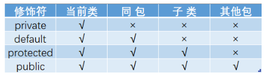

# JAVA 基础 - 关键字

## 1.public、private、protected访问修饰符

- public：对所有类可见
- protected：对同一包内所有的类和子类可见（不能修饰类）
- （default）：对同一包内可见
- private：只在当前类内可见（不能修饰类）

## 2.final关键字

final可以修饰类、方法和变量。
- 类：被final修饰的类不可以被继承
- 方法：被final修饰的方法不可以被重写
- 变量：被final修饰的变量不可以被修改

## 3.this、super关键字
this是指向自己本身的一个指针，一般用于解决局部变量和实例变量之间的重名问题
super是指向自己超类的一个指针，用于调用离自己最近的一个父类的方法

## 4.static关键字
static关键字作用于属性或者方法上，被static修饰的属性和方法即使没有创建对象，也可以被调用。（不需要new 直接用）
被static修饰的属性和方法有且只有一个副本，在类加载的时候已经分配好空间了，以后创建多个类对象的时候也不会重新分配，多个类对象共享此静态方法/属性。
**意义**：用于生成静态代码块优化程序性能，因为他只会在初次加载的时候执行一次。
**特点**：
1、静态只能访问静态
2、非静态可以访问静态
