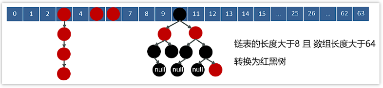
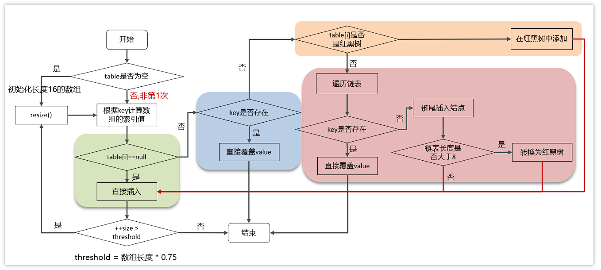
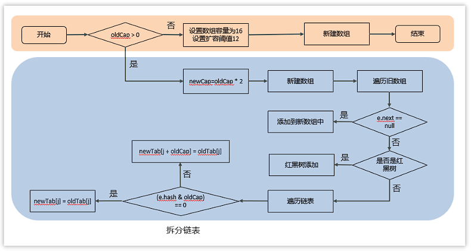

# JAVA 基础 - 集合

[[toc]]

## 1.迭代器Iterator
迭代器是在Collection接口中定义的，所有实现了Collection的类都具有此功能（List、Set），迭代器的主要功能就是单向轮训Collection中所有的元素。
主要用处就是在边轮训的时候边移除其中的元素。
```java
Iterator<String> it = testList.iterator();
while(it.hasNext()){
    String temp = it.next();
    if (temp.equals("a") || temp.equals("d")){
        it.remove();
    }
}
```

## 2.ArrayList和LinkedList
**ArrayList**：基于动态数组的数据结构，在内存中地址连续，可以看做一个能够自动增长容量的数组。
- 优势：由于地址连续，查询操作效率比较高
- 缺点：插入和删除操作效率较低，因为插入和删除要将后方的元素全部移动

**LinkedList**：基于双向链表的数据结构，地址是任意的，不需要等待开辟一个连续的地址
- 优势：插入和删除操作效率较高，只需要移动指针即可
- 缺点：由于地址不连续，还需要通过指针查询下一个，查询性能较低

## 3.HashMap和HashTable
- **父类**：
HashMap继承自AbstractMap、HashTable继承自Dictionary。
两者均实现了Map、Cloneable、Serializable
- **对外提供接口**：
HashTable多提供了一个elments()方法，这个方法是继承自Dictionary抽象类的，主要功能是返回这个Hashtable中的value枚举。
- **线程安全**：
HashMap是线程不安全的，Hashtable是线程安全的，他的每个方法上面都有synchronized关键词。
但是由于有同步锁，导致Hashtable的性能比较差，在多线程的情况下官方推荐使用ConcurrentHashMap来解决线程安全的问题，其使用分段锁来实现线程安全，所以性能更强，具体参见线程安全一节。

## 4.HashMap详解
### 4.1 数据结构
底层使用散列表数据结构，即数组+链表或红黑树。
jdk1.7之前是数组+链表
jdk1.8之后是数组+链表或红黑树，链表长度大于8且数组长度大于64则会从链表转化为红黑树



#### 4.1.1 主要常量与属性

主要常量与属性如下：
```java
static final int DEFAULT_INITIAL_CAPACITY = 1 << 4; //默认的初始化容量，16

static final float DEFAULT_LOAD_FACTOR = 0.75f; //默认的加载因子（扩容阈值=数组容量*加载因子）

transient Node<K,V>[] table; //实际储存数据的table，是一个node数组

transient int size; //当前存储元素的个数

static final int TREEIFY_THRESHOLD = 8; //链表转红黑树的边界

static final int UNTREEIFY_THRESHOLD = 6; //红黑树转回链表的边界
```

#### 4.1.2 Node数组

table的属性Node类源码如下，其本质就是一个键值对的存储类
```java
static class Node<K,V> implements Map.Entry<K,V> {
    final int hash; //哈希值
    final K key; //k
    V value; //v
    Node<K,V> next; //链表或红黑树的下一个节点
    ...
}
```

#### 4.1.3 构造方法
hashMap的默认无参构造方法为：
```java
public HashMap() {
    this.loadFactor = DEFAULT_LOAD_FACTOR; // all other fields defaulted
}
```
由此不难看出HashMap在创建对象的时候并没有初始化Node数组

### 4.2 hash(key)方法

hash方法的源码为：
```java
static final int hash(Object key) {
    int h;
    return (key == null) ? 0 : (h = key.hashCode()) ^ (h >>> 16);
}
```
看出此方法返回了key.hashcode按位异或key.hashcode右移16位，那这个数是如何转为数组的下标的呢？参考putVal源码：

```java
final V putVal(int hash, K key, V value, boolean onlyIfAbsent,
               boolean evict) {
    Node<K,V>[] tab; Node<K,V> p; int n, i;
    if ((tab = table) == null || (n = tab.length) == 0)
        n = (tab = resize()).length;
    if ((p = tab[i = (n - 1) & hash]) == null)  //主要看此处
        tab[i] = newNode(hash, key, value, null);
    }
```

参考源码中的tab[i = (n - 1) & hash]，可以看到下标主要由 (n - 1) & hash获取，n即为数组大小，hash为上方方法返回值，即数组长度-1按位与上方返回的哈希值，在数组长度为2的n次方的时候，此计算等同于求模。
**总结**-HashMap中key是如何转为数组下标的：
1、首先获取Key的HashCode，然后用此HashCode按位异或此HashCode右移16位（扰动算法，使hash值分布更加均匀）
2、用数组长度-1按位与hash值，得到数组中的索引（实际等当于求模操作，数组长度为2的n次方的时候）

### 4.3 put()方法



- 1、首先判断数组`table`是否为空，如果为空则使用`resize()`方法初始化长度为16的数组；
- 2、不为空则证明不是第一次put，则根据key计算hash值，即hash(key)为table数组的索引；
- 3、判断`table[hash(key)]`是否为null，如果为null直接把Node节点插入即可；
- 4、如果`table[hash(key)]`不为null，则证明已经有Node节点，此时需要判断各种情况：
  - 4.1、判断此位置的Node节点的key值与传入的key值是否一致，如果是的话直接覆盖value至此Node；（put了相同key不同value的情况，覆盖value）
  - 4.2、如果key不一致则证明发生了哈希冲突，再判断`table[hash(key)]`此位置是否为红黑树，如果是的话则直接使用`TreeNode.putTreeVal`方法放入值；
  - 4.3、如果不为红黑树则证明`table[hash(key)]`此位置为链表，遍历链表判断key是否存在，如果存在直接覆盖value；（在hash冲突的前提下put了相同key不同value的情况，覆盖value）
  - 4.4、如果不存在，则证明此key没有插入过，在链表尾部插入Node节点即可，插入完成后看链表长度是否大于8，如果大于8则把链表转换为红黑树；
- 5、插入成功后，判断table[]中的键值对Node数量size是否大于threshold扩容阈值，如果超过了就调用`resize()`进行扩容;

### 4.4 resize()扩容方法



- 1、初始化的时候调用`resize()`时旧容量=0，设置容量为16、扩容阈值为12新建数组。
- 2、如果旧容量大于0则证明不是初始化，需要扩容，设置新容量为旧容量的两倍，按照新容量创建新的数组。
  - 2.1、如果Node节点的next为null，也就是没有hash冲突的节点，使用 `(newCap - 1) & hash`计算出新位置即可
  - 2.2、如果节点下方为红黑树，将红黑树添加到对应位置
  - 2.3、如果节点下方为链表，需要遍历链表，可能需要拆分链表，分别放到新位置。