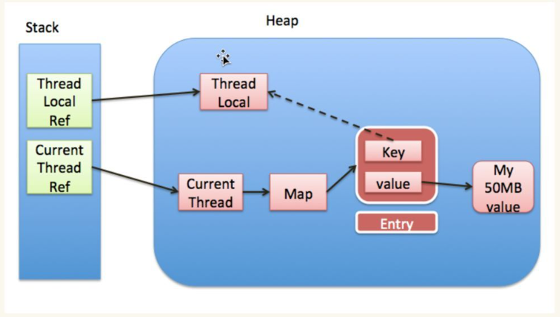

# JAVA 并发 - 线程基础

[[toc]]


## 1.创建线程的几种方式
### 2.1 继承Thread类
```java
public class MyThread extends Thread{
    @Override
    public void run(){
        System.out.println("当前线程是：" + Thread.currentThread().getName());
    }
}
```
```java
@GetMapping("/thread")
public void testThread(){
    MyThread myThread = new MyThread();
    myThread.start();
    System.out.println("主线程是：" + Thread.currentThread().getName());
}
```
运行结果：
```java
主线程是：http-nio-9000-exec-1
当前线程是：Thread-8
```

### 2.2 实现Runnable接口
```java
public class MyRunnable implements Runnable{
    @Override
    public void run() {
        System.out.println("当前线程是：" + Thread.currentThread().getName());
    }
}
```
```java
@GetMapping("/runnable")
public void testRunnable(){
    MyRunnable myRunnable = new MyRunnable();
    Thread thread = new Thread(myRunnable);
    thread.start();
    System.out.println("主线程是：" + Thread.currentThread().getName());
}
```
运行结果：
```java
主线程是：http-nio-9000-exec-2
当前线程是：Thread-9
```

### 2.3 实现Callable接口
```java
public class MyCallable implements Callable<String> {
    @Override
    public String call() throws Exception {
        System.out.println("当前线程是：" + Thread.currentThread().getName());
        return "这是来自子线程" + Thread.currentThread().getName() + "的信息，返回给主线程";
    }
}
```
```java
@GetMapping("/callable")
public void testCallable() throws ExecutionException, InterruptedException {
    MyCallable myCallable = new MyCallable();
    FutureTask<String> futureTask = new FutureTask<>(myCallable);
    Thread thread = new Thread(futureTask);
    thread.start();
    System.out.println(futureTask.get());
    System.out.println("主线程是：" + Thread.currentThread().getName());
}
```
运行结果：
```java
当前线程是：Thread-8
这是来自子线程Thread-8的信息，返回给主线程
主线程是：http-nio-9000-exec-1
```
可以看到子线程的值，返回给了主线程。
**Callable和Runnable的区别有以下三点**：
1、实现Callable的时候需要带一个泛型，重写call()方法的时候需要有返回值；Runnable重写run()方法没有返回值
2、Callable结合FutureTask使用可以获取返回值的结果。
3、Callable的call()方法允许抛出异常，Runnable的run()方法不可以抛出异常，只能内部消化。

### 2.4 线程池创建线程
复用Runnable的实现类
```java
@GetMapping("/executors")
public void testExecutors(){
    ExecutorService threadPool = Executors.newFixedThreadPool(3);
    MyRunnable myRunnable = new MyRunnable();
    threadPool.submit(myRunnable);
    threadPool.submit(myRunnable);
    threadPool.submit(myRunnable);
    threadPool.submit(myRunnable);
    System.out.println("主线程是：" + Thread.currentThread().getName());
}
```
运行结果：
```java
主线程是：http-nio-9000-exec-1
当前线程是：pool-1-thread-1
当前线程是：pool-1-thread-1
当前线程是：pool-1-thread-2
当前线程是：pool-1-thread-3
```
可以发现FixedThreadPool线程池最大线程数为3，提交了四个Runnable，复用了一个线程，具体可以看线程池一节。

## 2.线程的状态及状态之间的变化

线程的状态可以参考JDK中的`Thread`类中的枚举`State`：
- NEW：新建状态
- RUNNABLE：可运行状态
- BLOCKED：阻塞状态
- WAITING：等待状态
- TIME_WAITING：时间等待状态
- TERMINATED：终结状态
状态间的变化如下图所示：


> 1、创建线程对象（new Thread）是新建状态（NEW）；
> 2、调用Thread.start()方法转变为可执行状态（RUNNABLE）；
> 3、不论线程是否抢到CPU的执行权，都还是可执行状态（RUNNABLE）；
>> 3.1、如果无法获得锁，则进入阻塞状态（BLOCKED），重新获得锁之后变回可执行状态（RUNNABLE）；
>> 3.2、如果线程调用了wait()方法进入了等待状态（WAITING），其他线程使用notify()唤醒他之后变回可执行状态（RUNNABLE）；
>> 3.3、如果线程调用了sleep()方法进入了时间等待状态（TIME_WAITING），到时间后变回可执行状态（RUNNABLE）；
>
> 4、线程抢到了CPU的执行权，并且执行完成，是终结状态（TERMINATED）；


## 4.join()的用法
join()方法用于使当前线程进入等待（WAITING）状态，直到join()进来的线程执行结束，再执行当前线程，可以用于指定线程顺序。
```java
public static void main(String[] args) throws InterruptedException {

    Thread thread = new Thread(() -> {
        try {
            sleep(1000);
        } catch (InterruptedException e) {
            throw new RuntimeException(e);
        }
        System.out.println(Thread.currentThread().getName()+"test");
    });

    thread.start();
    System.out.println("++++++++++++++++++");
    thread.join();
    System.out.println("++++++++++++++++++");
}
```
以上述代码为例，使用join方法先执行子线程Thread，等Thread执行完成后才继续执行主线程，输出如下：
```java
++++++++++++++++++
Thread-0test
++++++++++++++++++
```
如果将join()这行注掉输出会变为：
```java
++++++++++++++++++
++++++++++++++++++
Thread-0test
```

## 5.wait()方法和sleep()方法的区别
**共同点**：两者都能让线程暂时放弃CPU的使用权
**不同点**：
1、方法归属不同：`sleep()`是`Thread`类的静态方法，`wait()`是`Object`的成员方法，每个对象都有
2、醒来时机不同：`wait()`可以被`notify()`和`notifyAll()`唤醒，`wait()`如果无参构建，就会一直等待下去
3、锁特性不同：`wait()`必须配合对象锁使用，`sleep()`不用；`wait()`执行结束之后会释放对象锁，`sleep()`不会释放
补充：notify()随机唤醒一个线程，notifyAll()唤醒所有线程

## 6.ThreadLocal
ThreadLocal可以实现对象的线程隔离，让每个线程用自己的对象，避免用共用的对象导致线程安全的问题，简单来说，就是维护了threadlocalvariable(线程局部变量)
主要方法包括：
- `set()` 设置值
- `get()` 获取值
- `remove()` 清除值
每个线程都有自己的`ThreadLocalMap`，其中`Key`为**ThreadLocal自己**，`Value`为**对象**；
- 调用`set()`方法，就是以ThreadLocal自己为Key，资源对象作为Value，放入当前线程的ThreadLocalMap中
- 调用`get()`方法，就是以ThreadLocal自己为Key，到当前线程的ThreadLocalMap中获取对应的资源对象
- 调用`remove()`方法，就是以ThreadLocal自己为Key，清除当前线程的ThreadLocalMap对应的值

以下代码为Thread类中的属性，可以看到ThreadLocalMap是每个线程中都有的属性。
```java
/* ThreadLocal values pertaining to this thread. This map is maintained
 * by the ThreadLocal class. */
ThreadLocal.ThreadLocalMap threadLocals = null;

/*
 * InheritableThreadLocal values pertaining to this thread. This map is
 * maintained by the InheritableThreadLocal class.
 */
ThreadLocal.ThreadLocalMap inheritableThreadLocals = null;
```
可以理解为：**ThreadLocal**本身是没有内容的，只是作为Map的Key标识，如果定义多个**ThreadLocal**，也只是额外在Map中增加了key。
例如调用**myThreadLocal**对应**ThreadLocal.set(obj)**方法本质上就是对此线程的**ThreadLocalMap**执行了类似Map的**put(myThreadLocal,obj)**的操作，只不过在**ThreadLocalMap**中定义为Entry数组，内部存在Key、Value。



*备注：ThreadLocal内存泄露的问题*
首先，观察一下ThreadLocal类的源码：


此时不难看出，ThreadLocalMap中存放数据的Entry是继承自弱引用的，再看他的构造方法，k是通过super(k)创建的，所以说ThreadLocalMap中的Key是弱引用，GC只要发现就会清理，那么为什么要这样设计呢？
首先根据源码，可以得出在执行ThreadLocal.get()方法时候，会自动清理key为null的value值，但如果是强引用，即是ThreadLocal已经被设置为null，断开了ThreadLocal Reference —> ThreadLocal的引用，但key依旧强引用了ThreadLocal，导致该对象永远无法被GC


但是需要说明的是，即是是通过弱引用的机制避免了一些情况下的内存泄露，但是依旧不能完全避免，比如以下情况：
1、使用线程池的情况，线程重复使用，没有调用remove()的情况。