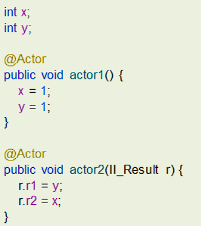
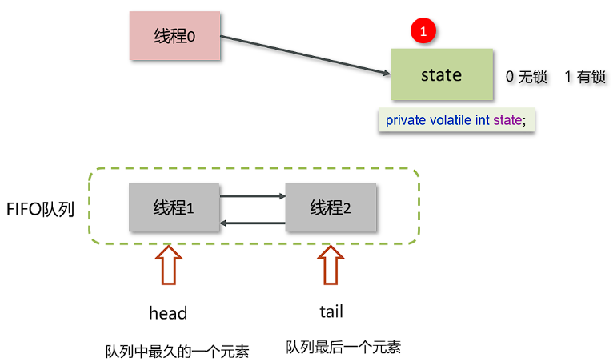

# JAVA 并发 - 锁

[[toc]]

## 1.synchronized关键字的使用
### 1.1 synchronized基本原理
**定义**：
synchronized是一种**对象锁**，采用互斥的方式让同一时刻至多只有一个线程能持有**对象锁**，其他线程再想获取这个**对象锁**时会被阻塞。
**底层实现**：
采用monitor实现，monitor时JVM级别的对象（由c++实现的），monitor主要由三部分组成：
1、owner：关联获得锁的线程，只能关联一个
2、entrylist：关联的是处于阻塞状态的线程
3、waitset：关联的是处于waiting状态的线程
**对象锁**：
对象是如何关联上monitor的呢，主要是通过对象头的Mark Word中被设置指向Monitor对象的指针。


获取锁的流程如下：
1、代码进入synchronized的代码块，先将lock对象关联monitor，判断owner是否已经有线程；
2、如果没有，就让当前线程持有，表示当前线程获取锁成功；
3、如果owner已经有线程，就让当前进程进入entrylist，并且进入阻塞状态；
4、如果owner持有的线程已经执行完毕释放了锁，在entrylist的线程去竞争执行权（非公平）

### 1.2 偏向锁、轻量级锁、重量级锁与锁升级
Monitor实现的锁属于重量级锁，因为涉及到用户态和内核态的切换，然而在很多情况下，synchronized代码块内部的代码是不存在竞争的，所以JVM为了优化性能，提供了锁升级机制。

偏向锁：锁只被一个线程持有
轻量级锁：不同线程交替持有
重量级锁：多线程竞争锁


备注：一旦锁发生了竞争，就会升级为重量级锁。

## 2.JMM（Java内存模型）的原理
JMM（Java Memory Model）即Java内存模型，他是在jvm中定义的一种内存模型，不是物理层面上的分层，而是一种概念。
主要定义了Java中线程共享的变量被不同线程读取时候的规则，以及在JVM中将变量存到内存中以及读内存中的变量的逻辑。
主要包含**主内存**和**工作内存**两块。


主要有以下几种特点：
- 所有的共享变量（例如堆中的对象）都储存于主内存。
- 每个线程都有自己的工作内存，保存了主内存中的共享变量的副本。
- 每个线程对变量的读写操作都是在自己的工作内存中执行的，不可以直接操作主内存。
- 不同线程间无法互访对方工作内存中的变量

## 3.CAS机制的原理
CAS即Compare And Swap，比较再交换，他是一种乐观锁思想的实现。最主要的特点是：在无锁的条件下保证线程操作共享数据的原子性
CAS机制当中使用了3个基本操作数：内存地址V，旧的预期值A，计算后要修改后的新值B。
一个当前内存值V、旧的预期值A、即将更新的值B，当且仅当旧的预期值A和内存值V相同时，将内存值修改为B并返回true，否则什么都不做，并返回false。如果CAS操作失败，通过自旋的方式等待并再次尝试，直到成功。


还是以JMM模型为例，此时有两个线程分别想操作共享变量中的V（int a =100），线程1想a++，线程2想a--
1、线程1、2分别从主内存中获取V（int a =100），放入两者的工作内存中，两个线程的旧预期值A均为（int a =100）
2、线程1、2分别执行++和--，线程1的修改后的新值B（int a = 101），线程2的修改后的新值B（int a = 99）
3、例如线程1先提交，会与主内存中的V进行CAS操作，比较线程1的A（int a =100）与主内存中的V（int a =100）是否一致，目前看是一致的，可以赋值，就把B（int a = 101），提交给主内存，此时主内存的V变为（int a = 101），如下图所示：


4、线程2也提交，比较线程2的A（int a =100）与主内存中的V（int a =101），发现不一致，发生自旋，重新从主内存中获取V，拉到线程2的工作内存中，重新赋值线程2的旧预期值A（int a =101）。
5、线程2重新对A（int a =101）进行--计算，结果值B为（int a =100），再将A（int a =101）与主内存中的V进行比较，发现一致，此时可以把B（int a =100）赋值给V。


## 5.volatile关键字
volatile关键字可以修饰共享变量和共享静态变量，主要作用有两点：**保证线程间的可见性**、**禁止指令重排序**。

### 5.1 保证线程间的可见性
原理：
如果一个类中有静态变量，按照常理来说不同线程对他操作，其他线程可见静态变量的变化。但实际上并没有这样，有些情况下其他线程无法看到静态变量的变化。


以上面为例，按照常理来说，在100毫秒后，静态变量stop会被子线程变为true，而下方foo方法中的死循环也将结束，但实际上执行，下方的死循环并没有结束。
主要原因是JVM中的JIT（即时编辑器），他会将重复多次的代码进行优化，由于下方while循环过多次等于true，JIT默认认为他就为true，哪怕静态变量已经修改。

**解决方案**：
启动类加入jvm参数 -Xint禁用JIT（不推荐），变量加上volatile注解（推荐）

### 5.2 禁止指令重排序
原理：
为了效率，jvm编译器和解释器都有可能会对代码指令顺序进行重排序，以如下代码为例：



两个线程分别对xy进行操作，不论顺序如何，r1、r2永远都不可能出现1、0这种情况
（可能有的情况是：actor1未执行，就已经执行完actor2，r1、r2分别为0、0；actor1执行了一行，就已经执行完了actor2，r1、r2分别为0、1；actor1全部执行完，再执行actor2，r1、r2分别为1、1）
但实际测试上，就是会有1、0这种情况，也就是说y=1在x=1之前执行了，这就是指令的重排序。

**解决方案**：
此时只需要在y上面加volatile关键字，即可禁止重排序。


- 写操作加的屏障是阻止上方其它写操作越过屏障排到volatile变量写之下
- 读操作加的屏障是阻止下方其它读操作越过屏障排到volatile变量读之上

## 6.AQS的实现
AQS全称AbstractQueuedSynchronizer，即抽象队列同步器，他是阻塞式锁和相关同步工具的基础框架
AQS常见的实现类包含：
- ReentrantLock 阻塞式锁
- Semaphore 信号量
- CountDownLatch 倒计时锁

### 6.1 工作机制
在AQS中维护了一个被volatile修饰的变量state表示资源的状态，0表示无锁、1表示有锁。
在AQS中维护了一个FIFO队列，为线程的等待队列，其中由双向链表实现，类似于Synchronized中monitor的entrylist。



主要流程如下：
1、线程0来了以后，去尝试修改state属性，如果发现state属性是0，就修改state状态为1，表示线程0抢锁成功。
2、线程1和线程2也会先尝试修改state属性，发现state的值已经是1了，有其他线程持有锁，它们都会到FIFO队列中进行等待。
3、如果state=0时有多个线程同时抢夺，通过CAS机制保证线程间的原子性，修改失败的线程进入FIFO队列等待。

## 7.ReentrantLock实现原理

RenntrantLock直译是可重入锁，主要利用CAS+AQS队列实现。相对于synchronized其支持更多的特性，包括`可中断`、`可设置超时时间`、`可设置公平锁`等特性，参考下表：

|               | ReentrantLock | Synchronized       |
| :-----------: | :-----------: | :-----------: |
|     锁实现     |      依赖AQS | 监视器Monitor模式   |
|     实现方式   |      java实现 | 关键词，c++实现  |
|     灵活性     |      支持响应中断、超时、尝试获取锁 | 不灵活   |
|     释放形式     |     必须显示的调用unlock()释放锁 | 自动释放监视器  |
|     锁类型     |     悲观锁、公平锁&非公平锁 | 悲观锁、非公平锁   |
|     条件队列     |  可关联多个队列 | 关联一个条件队列   |
|     可重入性     |    可重入 | 可重入         |

使用方式如下，ReentrantLock还有一个boolean型入参的构造方法，判断是否创建一个公平锁还是非公平锁。

```java
//公平锁
ReentrantLock reentrantLock = new ReentrantLock(true);
try {
    reentrantLock.lock();
} finally {
    reentrantLock.unlock();
}
```
其中ReentrantLock的构造方法内就是new了一个NonfairSync或FairSync，这两者都是继承自Sync，Sync继承自AbstractQueuedSynchronizer（AQS），所以他的工作原理与AQS基本一致。


一句话问题：都有Synchronized了还需要ReentrantLock干啥？
回答：Synchronized是JVM提供的锁，释放锁的时机无法手动控制，并且支持公平锁的配置，还支持对等待锁的线程响应中断，synchronized不行；支持设置获取锁的超时时间。还支持唤醒指定线程，synchronized只能随机唤醒。

### 7.1 ReentrantLock特性之超时
以以下代码为例，此处调用的Api较慢，虽然finally还是会unlock，但是扔会使其他线程阻塞较长时间：
```java
ReentrantLock reentrantLock = new ReentrantLock(true);
try {
    reentrantLock.lock();
    someApi();//此处Api调用较慢
} finally {
    reentrantLock.unlock();
}
```

可以使用reentrantLock的tryLock特性，设置获取锁的超时时间，一旦超时直接走if的另外分支抛异常或其他。注意使用tryLock()方法之后，就不需要再调用lock()方法了
```java
//公平锁
ReentrantLock reentrantLock = new ReentrantLock(true);
try {
    if (reentrantLock.tryLock(5, TimeUnit.SECONDS)){
        someApi();//此处Api调用较慢
    }else {
        System.out.println("获取锁超时");
    }
} catch (InterruptedException e) {
    throw new RuntimeException(e);
} finally {
    reentrantLock.unlock();
}
```


### 7.2 ReentrantLock特性之中断
中断指的是持续等待获取锁的线程，手动中断等待的行为，直接进入异常处理环境。可中断的锁需要用lockInterruptibly()方法而不是lock()方法，如下列代码中，线程1永远无法获得锁，手动打断后直接进入异常处理阶段
```java
//公平锁
ReentrantLock reentrantLock = new ReentrantLock(true);
Thread thread1 = new Thread(()-> {
    try {
        try {
            reentrantLock.lockInterruptibly();
            System.out.println("线程1成功获取锁");
        } catch (InterruptedException e) {
            System.out.println("线程被打断");
            throw new RuntimeException(e);
        }
    } finally {
        reentrantLock.unlock();
    }
});
reentrantLock.lock();
System.out.println("主线程成功获取锁");
thread1.start();
Thread.sleep(1000);
thread1.interrupt(); //此处打断
```

## 8.CountDownLatch的实现
CountDownLatch（倒计时锁）用来进行线程同步协作，等待所有线程完成倒计时，之后才能继续执行，主要涉及到的方法有：
- CountDownLatch(int count) 构造函数来初始化计数值
- await() 等待计数值归0
- countDown() 让计数减一


测试代码如下，只有等到三个子线程全部执行完，主线程才会继续执行：

```java
//计数3
CountDownLatch countDownLatch = new CountDownLatch(3);
for (int i = 0; i < 3; i++){
    Random random = new Random();
    int minValue = 1000;
    int maxValue = 10000;
    int randomValue = random.nextInt(maxValue - minValue + 1) + minValue;
    new Thread(()->{
        System.out.println(Thread.currentThread().getName() + "正在启动");
        try {
            Thread.sleep(randomValue);
        } catch (InterruptedException e) {
            throw new RuntimeException(e);
        }
        System.out.println(Thread.currentThread().getName() + "启动结束,准备释放CountDownLatch,当前剩余数量是："+countDownLatch.getCount());
        countDownLatch.countDown();
    }).start();
}
System.out.println(Thread.currentThread().getName() + "主线程即将停止");
countDownLatch.await();
System.out.println(Thread.currentThread().getName() + "主线程恢复运行");
```

## 9.Semaphore的实现
Semaphore（信号量）主要用于控制多线程的情况下，并发执行的访问量，即多线程限流，同一时刻下，同步执行的线程不超过Semaphore设置的信号量；主要的方法包括：
- Semaphore(int count) 构造函数来初始化信号量
- acquire() 请求一个信号量，信号量个数-1
- release() 释放一个信号量，信号量个数+1

测试代码参考：

```java
//信号量为3
Semaphore semaphore = new Semaphore(3);
for (int i = 0 ; i < 10 ; i++){
    new Thread(() -> {
        try {
            //请求一个信号量，如果没有信息量则会阻塞
            semaphore.acquire();
            System.out.println(Thread.currentThread().getName() + "获取到锁，开始执行");
            Thread.sleep(3000);
        } catch (InterruptedException e) {
            throw new RuntimeException(e);
        } finally {
            //释放一个信号量
            semaphore.release();
            System.out.println(Thread.currentThread().getName() + "执行完毕，释放锁");
        }
    }).start();
}
```

## 10.ConcurrentHashMap原理
ConcurrentHashMap是HashMap的线程安全版本，底层逻辑与HashMap一样，都是采用数组+链表+红黑树来实现逻辑的，区别则是采用CAS操作与Synchronized关键字来实现线程安全的。

- CAS操作确保数组节点的添加
- Synchronized锁定链表或红黑树的首节点，只要不发生哈希冲突，就没有并发的问题


备注，HashTable是简单的在put和get操作及其他所有操作上加synchronized锁，性能较差

## 11.死锁的产生条件
- 互斥：一段时间内一个资源只能被一个线程占用
- 请求和保持：线程在请求锁而进入阻塞状态的时候，对已获取的资源一直持有
- 不可剥夺：线程在资源使用完之前不可被其他线程强行剥夺，只能等待自己释放
- 循环等待：存在线程资源的循环链