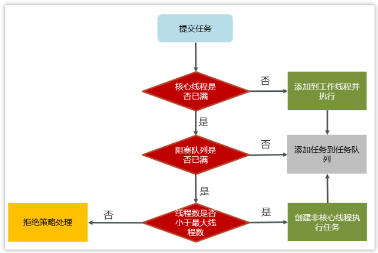
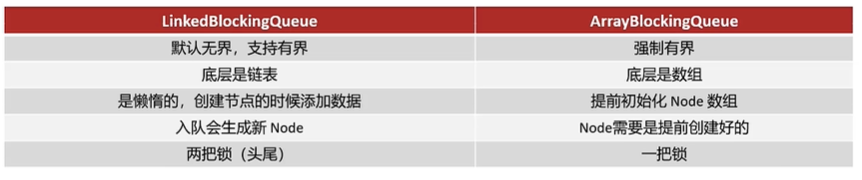

# JAVA 并发 - 线程池

[[toc]]

## 1.为什么要用线程池
每次创建和销毁线程都会消耗内存资源，并且容易造成线程切换频繁，所以需要线程池来管理线程。

## 2.线程池的核心参数与执行原理
### 2.1 核心参数
主要参考ThreadPoolExecutor类的七个参数的构造方法：
```java
public ThreadPoolExecutor(int corePoolSize,
                          int maximumPoolSize,
                          long keepAliveTime,
                          TimeUnit unit,
                          BlockingQueue<Runnable> workQueue,
                          ThreadFactory threadFactory,
                          RejectedExecutionHandler handler)
```
- corePoolSize：核心线程数目
- maximumPoolSize：最大线程数目（核心线程数目+应急线程数目）
- keepAliveTime：应急线程的生存时间，此时间内没有新任务则释放线程资源
- unit：应急线程的生存时间单位
- workQueue：阻塞队列，当没有空闲的核心线程时，新来的任务会加入此队列排队
- threadFactory：线程工厂，可以定制线程对象的创建，例如设置线程名字等
- handler：拒绝策略，当所有线程都在繁忙时、workQueue也放满时会触发拒绝策略

### 2.2 执行原理



1、任务在提交之后，首先判断核心线程是否已满，如果没满则直接添加到核心线程执行
2、如果核心线程已满，则判断阻塞队列是否已满，如果阻塞队列没有满的话就把线程加入阻塞队列中等待
3、如果阻塞队列也满了，则判断是否还有应急线程数量，如果当前线程数小于最大线程数，则创建应急线程执行，
4、如果核心线程和应急线程中执行完任务，会去阻塞队列中检查是否有需要执行的线程，如果有就执行（也需要看应急线程配置的存活时间）
5、如果所有核心线程与应急线程都在执行线程，则走拒绝策略。


### 2.3 拒绝策略的分类
其中，`RejectedExecutionHandler`有四种：
- AbortPolicy：直接抛出异常，默认策略；
- CallerRunsPolicy：用调用者所在的线程来执行任务；
- DiscardOldestPolicy：丢弃阻塞队列中靠最前的任务，并执行当前任务；
- DiscardPolicy：直接丢弃任务；

### 2.4 阻塞队列的分类
常用阻塞队列有以下几种：
- ArrayBlockingQueue：基于数组结构的有界阻塞队列，FIFO
- LinkedBlockingQueue：基于链表结构的有界阻塞队列，FIFO
- DelayedWorkQueue：优先级队列，保证每次出队列的任务都是当前队列中执行时间最靠前的
- SynchronousQueue：不存储元素的阻塞队列，每次插入都需要等待一个移除操作



## 3.线程池的种类

在Executors类中提供了很多创建线程池的静态方法：（其实都是基于ThreadPoolExecutor封装的方法）

### 3.1 newFixedThreadPool
使用**固定线程数**的线程池，参数需要传入一个int型的线程数量，源码如下：
```java
public static ExecutorService newFixedThreadPool(int nThreads) {
    return new ThreadPoolExecutor(nThreads, nThreads,
                                  0L, TimeUnit.MILLISECONDS,
                                  new LinkedBlockingQueue<Runnable>());
}
```
可以看出，核心线程与最大线程一致，均为用户设置的线程数量，没有应急线程；阻塞队列是`LinkedBlockingQueue`，最大容量为`Integer.MAX_VALUE`。
**适用场景**：适用于任务量已知，相对耗时的任务

### 3.2 newSingleThreadExecutor
使用**单线程**的线程池，不需要参数，源码如下：
```java
public static ExecutorService newSingleThreadExecutor() {
    return new FinalizableDelegatedExecutorService
        (new ThreadPoolExecutor(1, 1,
                                0L, TimeUnit.MILLISECONDS,
                                new LinkedBlockingQueue<Runnable>()));
}
```
核心线程与最大线程一致，均为1，没有应急线程；阻塞队列是`LinkedBlockingQueue`，最大容量为`Integer.MAX_VALUE`，保证所有任务线程按照提交顺序执行（FIFO）。
**适用场景**：适用于按照顺序执行的任务

### 3.3 newCachedThreadPool
使用**可缓存**的线程池，不需要参数，源码如下：
```java
public static ExecutorService newCachedThreadPool() {
    return new ThreadPoolExecutor(0, Integer.MAX_VALUE,
                                  60L, TimeUnit.SECONDS,
                                  new SynchronousQueue<Runnable>());
}
```
核心线程数量为0，最大线程为`Integer.MAX_VALUE`，即所有线程均为应急线程，应急线程的存活时间为60s；阻塞队列是`SynchronousQueue`，自身不存储元素，每个插入操作都必须等待一个移除操作。
**适用场景**：适合任务数比较多，但每个任务的执行时间比较短的情况


### 3.4 newScheduledThreadPool
**可延迟执行**的线程池，入参需要填核心线程数，源码如下：
```java
public ScheduledThreadPoolExecutor(int corePoolSize) {
    super(corePoolSize, Integer.MAX_VALUE, 0, NANOSECONDS,
          new DelayedWorkQueue());
}
```
核心线程数为用户指定，最大线程为`Integer.MAX_VALUE`；阻塞队列是`DelayedWorkQueue`，优先级队列。其特点是可以设置线程的延迟执行时间。
适用场景：有延迟执行需求的任务


### 3.5 为什么不建议用Executors去创建线程池
`FixedThreadPool`、`SingleThreadExecutor`的阻塞队列均为最大值为`Integer.MAX_VALUE`的`LinkedBlockingQueue`，如果堆积过多容易OOM
`CachedThreadPool`的线程数最大值为`Integer.MAX_VALUE`，如果有过多线程进来也会OOM
推荐使用`ThreadPoolExecutor(七个参数)`的方法手动创建。

## 4.如何确定核心线程数

CPU密集型（数学计算操作、json转换）：核心线程数=CPU核数
IO密集型（文件读写、网络请求、DB）：核心线程数=2*CPU核数
原因：IO密集型对CPU的使用率较低，程序大部分时间都是在等待IO读写，所以设置成CPU核数的两倍，当线程进行IO操作CPU空闲时，有其他线程可以继续使用CPU，提升CPU的使用率
