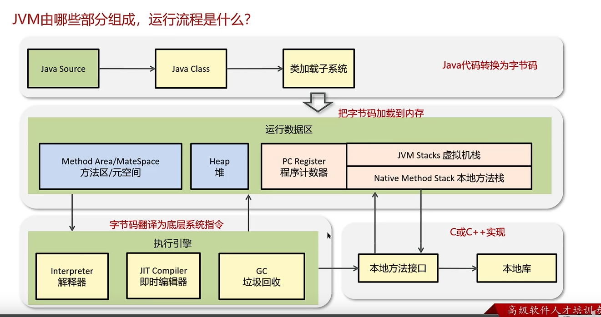
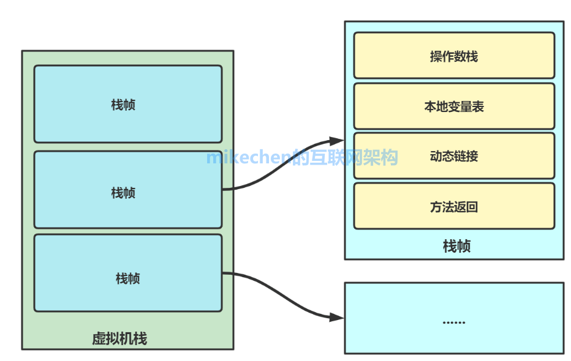
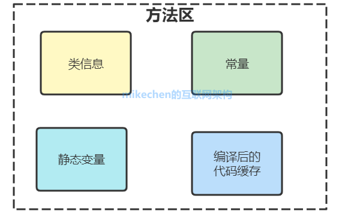
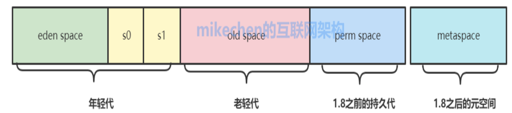
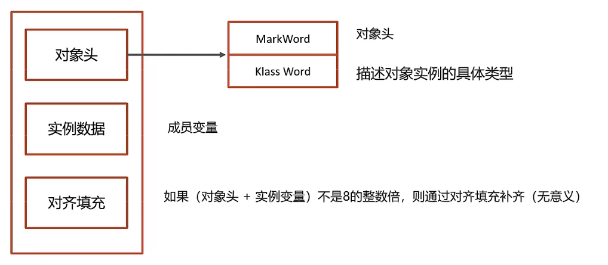

# JAVA 虚拟机 - 内存模型

[[toc]]

## 1.内存模型整体概述
堆和方法区是线程共有的，虚拟机栈、本地方法栈、程序计数器是线程私有的。

### 1.1 程序计数器（Program Counter Registers）线程私有

当同时运行的线程数，超过CPU核数的时候（同一时刻，一核CPU只能执行一个线程），就会通过时间片轮询机制给多线程派发CPU资源，所以发生线程切换是很平常的事情，为了各条线程切换之后程序执行能恢复到正确位置，此时每个线程就需要一个自己的计数器，记录接下来要执行的指令。

除此之外，分支、循环、跳转、异常处理、线程恢复等基础功能都需要依赖这个计数器来完成。

当线程正在执行一个Java方法，程序计数器记录的是正在执行的JVM字节码指令的地址；如果正在执行的是一个Natvie（本地方法），那么这个计数器的值则为空（Underfined）。

### 1.2 虚拟机栈（JVM Stacks）线程私有

每个线程在创建的时候都会创建一个虚拟机栈，其内部保存着一个个的栈帧（Stack Frame），对应着一次次的java方法调用，每一个方法执行从被调用到结束的全生命周期，就对应着一个栈帧的入栈和出栈，这也就解释了为什么要用栈的数据结构。

最顶部的栈帧被称为当前栈帧，对应的方法被称为当前方法，JVM在当前线程中只会对当前栈帧进行操作。

每一个栈帧包含的内容有参数（对象的引用）、局部变量（对象的引用）、操作数栈、动态链接、方法返回地址和一些额外的附加信息。

简单来说，在栈帧中除保存基本数据类型外，其他保存的局部变量、方法参数、返回值等如果是引用类型，则都是对堆中对象的引用。

### 1.3 本地方法栈（Native Stacks）线程私有

本地方法栈与虚拟机栈功能基本类似，其区别是虚拟机栈为虚拟机执行Java 方法（也就是字节码）服务，而本地方法栈则是为虚拟机使用到的Native方法服务。

虚拟机规范中对本地方法栈中的方法使用的语言、使用方式与数据结构并没有强制规定，例如可以使用C语言，这个要看具体的虚拟机的实现。

### 1.4 方法区（Method Area）线程公有
方法区是线程共享的，用于存放被虚拟机加载的类元数据（Klass）、如成员变量、静态方法、构造函数等信息。

#### 1.4.1 类信息：
对于每个加载类型（class、interface、enum、annotation），JVM会在方法区中存储以下类信息：
- 类完整名称（com.xxx.class）
- 类的父类名（java.lang.Object）
- 类的修饰符（public、abstract、final）
- 这个类型直接接口的一个有序列表

#### 1.4.2 域（Field）信息：
JVM会在方法区中保存域信息以及域的声明顺序：
- 域名称
- 域类型
- 域修饰符（public, private,protected,static,final, volatile, transient）

#### 1.4.3 方法(Method)信息
JVM会在方法区保存方法的所有信息，以及声明顺序：
- 方法名称
- 方法的返回类型、方法的参数
- 方法的修饰符（public, private,protected,static, final,synchronized,native,abstract）
- 方法的字节码、操作数栈、局部变量表

### 1.5 堆（Heap）线程公有

堆中存放了基本所有的对象实例和数组，包括类对象（Class）。

堆被分成两个区域：新生代 ( Young )、老年代 ( Old ) （jdk1.8之前还有持久代，之后被移除）。其中新生代又被分成三个区域：Eden、S0、S1。三者比例大概是8:1:1

新生代和老年代的GC参考垃圾回收一节

**简单说一下堆和栈的区别**：

栈是运行时单位，代表着逻辑，内含基本数据类型和堆中对象的引用
堆是存储单位，代表着数据，内含对象

区别：
1、功能不同
2、共享性不同，栈线程私有，堆线程共有
3、空间大小不同，堆远大于栈

## 2.对象的内存结构
在HotSpot虚拟机中，对象在内存中可以存储的布局可以分为三个部分：对象头、实例数据和对齐填充。

