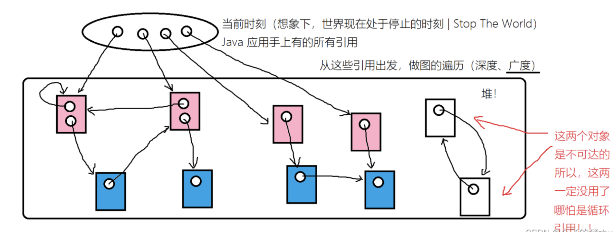
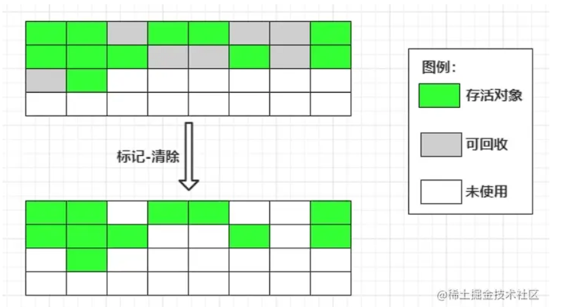
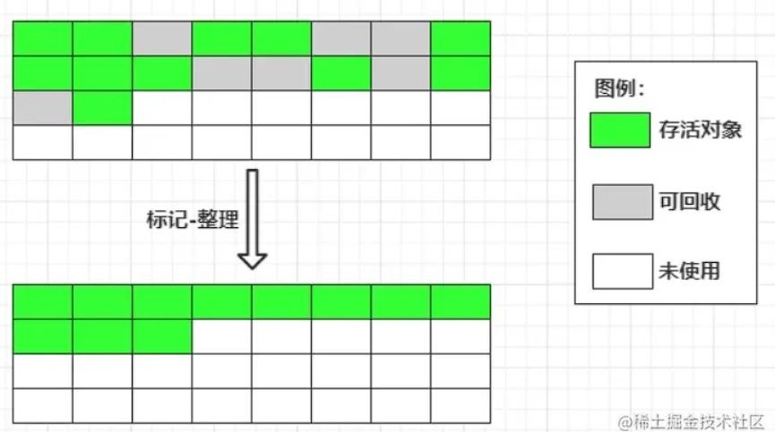
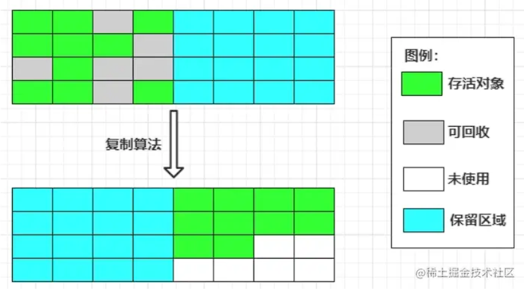
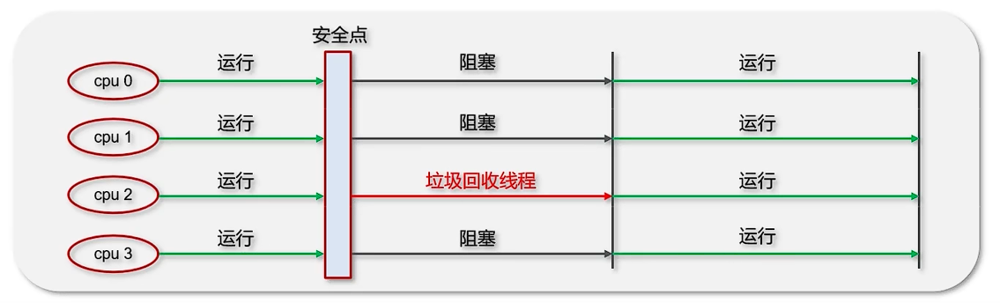
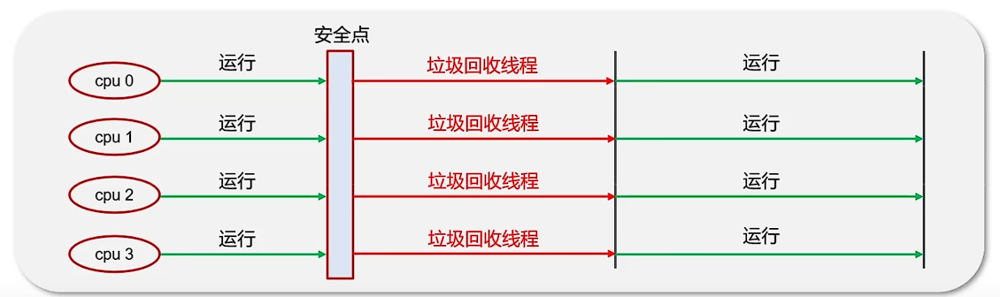
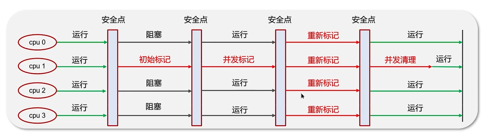

# JAVA 虚拟机 - 垃圾回收

[[toc]]

## 1.什么是垃圾
例如代码：
```java
Object o = new Object();
```
此时就会在堆中划出一片内存保存内容，o保存了这个对象的内存地址，如果再执行：
```java
o = null;
```
在堆中为new Object()分配的内存此时没有被任何变量引用，没有变量知道他的存在、访问它，所以这块内存就称为垃圾。

垃圾：程序中的一块内存没有被任何变量持有引用，导致这块内存无法被这个程序再次访问时，这块内存被称为垃圾。

## 2.如何判断一个对象是否存活
JAVA堆中几乎存储着所有的对象实例，在进行GC前，需要判断哪些对象还活着，哪些已经死了，判断对象是否存活有几种方法：

### 2.1 引用计数法
给每个对象设置一个引用计数器，当有一个地方引用这个对象的时候计数+1，引用失效后计数-1，当引用计数器为0的时候则证明这个对象没有被引用，可以被gc。

但这种方法无法解决循环引用的问题，当A引用B、B引用A且并没有第三者引用这俩对象的时候，这两者虽然应该被GC但是计数器并没有归0，也就不会被GC，所以主流虚拟机一般都不会采用这个方法。

### 2.2 可达性分析法
从一个被称为GC root的节点向下找，如果一个对象到GC root之间没有任何引用链相连的时候，则证明他不可用，可以被GC。

可以作为GC root的有以下几种：
- 虚拟机栈中引用的对象；例如方法中的`Object o = new Object()` ；
- 方法区中静态属性引用的对象；例如类中的`private static User user = new User()` ；
- 方法区中常量池引用的对象；例如类中的`private static final User user = new User()`；
- 本地方法栈JNI引用的对象（Native方法）；



*简单理解*：例如ArrayList list = new ArrayList(); 此时堆中会开辟新的内存空间保存此ArrayList对象，虚拟机栈的栈帧中也会给list分配内存空间，创建对此堆中对象的引用，此时如果执行list = null，则堆中ArrayList的对象没有被引用，将被GC。

## 3.垃圾回收算法

### 3.1 标记-清除算法

标记清除算法是最基础的垃圾回收算法，由标记和清除两个步骤构成：

**标记**：通过可达性分析法判断对象是否存活，标记其中不存活的对象。
**清除**：统一把之前不存活的对象全部清除。



**优点**：此方法不会操作仍存活的对象，所以性能比较高
**缺点**：清理完成后会产生大量不连续的内存，放大对象比较困难

### 3.2 标记-整理算法

标记整理算法与标记清除算法类似，由标记和整理两个步骤构成：

**标记**：通过可达性分析法判断对象是否存活，标记其中不存活的对象。
**整理**：不会直接清理不存活的对象，而是将存活的对象都向一端移动，然后将存活对象边界以外的内存全部清理掉。



**优点**：内存上不会存在碎片问题，新对象分配简单
**缺点**：存活的对象较多的情况下性能较差

### 3.3 复制算法
复制算法把内存平均分成了两块，例如S0、S1，每次新建对象的时候只使用其中一块（S0），当S0使用完之后，便将S0中仍存活的对象移动到S1中，再将S0全部清理。



**优点**：不会产生内存碎片，每次只清理一半性能高
**缺点**：内存可用空间只有一半

## 4.分代收集法
是绝大多数JVM垃圾回收器采用的算法，根据新生代和老年代采用不同的清理方法。新生代每次垃圾回收的时候都有大量对象需要清理，老年代只有少量对象需要清理。所以需要根据新生代、老年代不同的特性，选择不同的垃圾回收方法。

默认来说，一个对象刚创建出来是在新生代，一个对象每次经过一次GC还存活的话，年龄就会+1，年龄大于15之后，就会进入老年代

### 4.1 新生代的回收算法

新生代分为一个伊甸区（Eden）、两个存活区（survivor0、survivor1）。当对象刚new出来的时候，通常会分配到Eden区。据统计Eden区在发生GC的时候存活对象只占10%，所以新生代整体用的复制算法进行GC，但是这里的复制算法并不是把内存均分为两部分，而是Eden、S0、S1（默认为8：1：1，可以通过 -XX:SurvivorRatio调整）

1、对象在伊甸区中被创建出来
2、伊甸区经过一次 GC 之后，存活的对象到达存活 1 区，清空伊甸区
3、伊甸区和存活 1 区的对象经历第二次 GC，存活的对象到达存活 2 区，清空伊甸区和存活 1 区
4、伊甸区和存活 2 区经历第三次回收，存活的对象到达存活 1 区，清空伊甸区和存活 2 区
5、循环往复...
6、每经过一次 GC，没被回收掉的对象年龄 + 1。当存活的对象到达一定年龄之后，新生代的对象到达老年代

### 4.2 老年代的回收算法
老年代大部分对象存活概率很高，而且发生GC的频率也低的多，一般采用的方法是**标记清除法**或**标记整理法**

## 5.Minor GC、Full GC分别在什么时候发生

Minor GC清理新生代、Full GC清理整个堆空间（包括新生代和老年代）。

Minor GC发生在新生代内存不够时，STW时间短。

Full GC发生在老年代内存不够时，JVM内存不够时，或者手动调用System.gc()的时候，STW时间长。

（PS：STW - Stop The World，暂停应用所有的线程，等待gc的完成）

## 6.对象分配的原则
对象优先分配到堆中新生代的Eden区，如果Eden区满了，则会执行一次Minor GC

大对象优先分配到堆中老年代，因为大对象需要大量连续的内存空间，这样做是为了避免新生代的复制算法发生大量内存拷贝。

## 7.垃圾回收器
### 7.1 串行垃圾回收器
`Serial`和`Serial Old`是串行垃圾回收器，采用单线程进行垃圾回收，此线程会阻塞所有其他线程，适合堆内存小的个人电脑。

`Serial`作用于新生代，采用复制算法。

`Serial Old`作用于老年代，采用标记-整理算法。

垃圾回收时只有一个线程在工作，java中其他线程都要暂停（STW），等待GC的完成。



### 7.2 并行垃圾回收器
`Parallel New`和`Parallel Old`是并行垃圾回收器，采用多线程进行垃圾回收，性能强，JDK8中默认的垃圾回收器。

`Parallel New`作用于新生代，采用复制算法。

`Parallel Old`作用于老年代，采用标记-整理算法。

垃圾回收的时候多个线程在工作，java中所有线程都要暂停（STW），等待GC的完成。



### 7.3 CMS并发垃圾回收器
CMS全程 concurrent Mark Sweep，是一种并发的，使用标记-整理算法的，专门针对老年代的垃圾回收器，最大的特点就是其停顿时间短，在进行垃圾回收期间，应用仍然可以正常运行。

