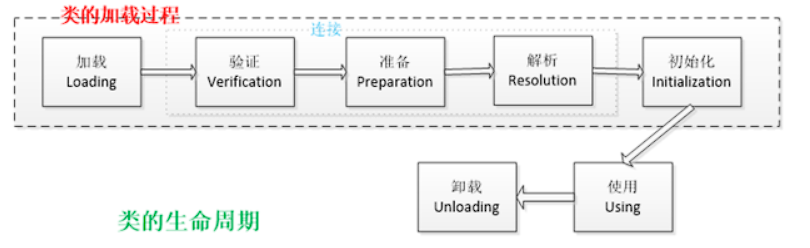
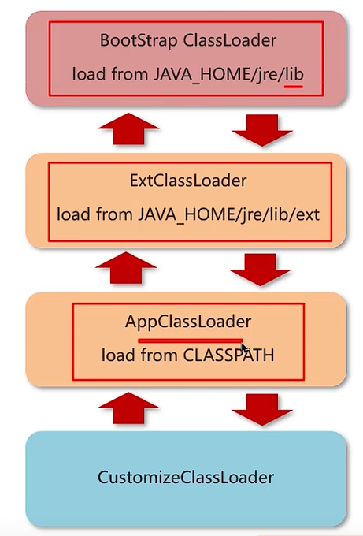

# JAVA 虚拟机 - 类加载

[[toc]]

## 1.类的生命周期简述
虚拟机将Class文件加载到内存，并且对数据进行校验、解析和初始化等操作，最终形成可以直接被java使用的类型。

类的加载的最终产品是位于堆区中的Class对象，Class对象封装了类在方法区内的数据结构，并且向Java程序员提供了访问方法区内的数据结构的接口。

- 加载，查找并加载类的二进制数据，在Java堆中也创建一个java.lang.Class类的对象
- 连接，连接又包含三块内容：验证、准备、初始化。 1）验证，文件格式、元数据、字节码、符号引用验证； 2）准备，为类的静态变量分配内存，并将其初始化为默认值； 3）解析，把类中的符号引用转换为直接引用
- 初始化，为类的静态变量赋予正确的初始值
- 使用，new出对象程序中使用
- 卸载，执行垃圾回收

## 2.类加载器

**定义**：JVM只会运行二进制文件，类加载器的作用是将字节码（class）文件加载到JVM中，从而让Java程序可以跑起来。

类加载器自顶向下主要分为四种：
### 2.1 启动类加载器 BootStrap ClassLoader
加载lib目录中所有的jar包
### 2.2 扩展类加载器 Ext ClassLoader
加载lib/ext中所有的jar包
### 2.3 应用类加载器 Application ClassLoader
加载开发者自己编写的Java类，默认的类加载器
### 2.4 自定义类加载器 Customize ClassLoader
实现自定义规则的类加载器，用的比较少

## 3.双亲委派模型
加载某一个类，先委托上一级的加载器进行加载，如果上级也有上级，则继续向上委托，如果向上委托的类加载器无法加载此类，才会一层一层尝试子加载器。

举例：
1、用户自定义Students类，首先应该由AppClassLoader加载，但会委派父级的ExtClassLoader，再委派父级的父级的BootStrapClassLoader，但是在lib里没有此类，则会向下找，在lib/ext中也没有此类，则会继续向下找，直到使用AppClassLoader 应用类加载器加载。

2、用户使用了String类，首先也是从AppClassLoader加载，一路向上找到启动类加载器BootStrapClassLoader，在lib目录下发现String类，则会使用启动类加载器BootStrapClassLoader加载此类

**JVM为什么要使用双亲委派模型？**
1、通过双亲委派机制可以避免某一个类被重复加载，当父类已经加载后，无需子类重新加载，比如String类
2、为了安全，保证类库API不会被篡改，比如自己定义一个java.lang.String类，运行时会抛出异常