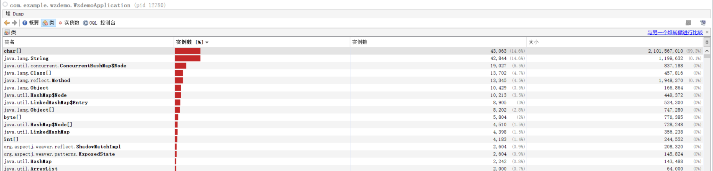
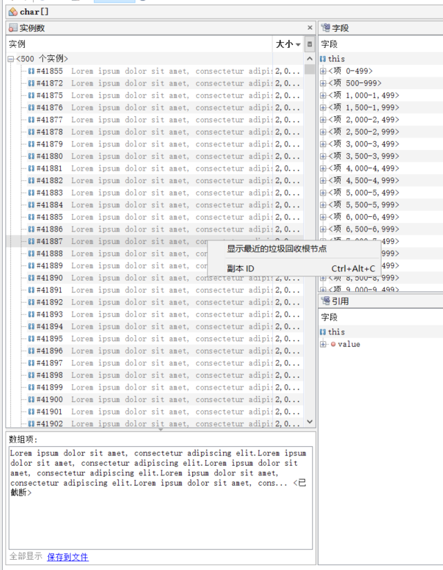
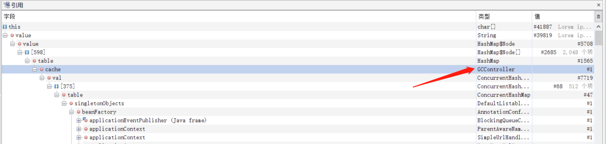

# JAVA 虚拟机 - 调优

[[toc]]

## 1.JVM究竟需不需要调优
通常来说，JVM参数配置只要遵循JVM官方的建议，90%的情况都是不用调优的。例如：
- -XX:NewRatio=2，设置年轻代比老年代的内存占比为1:2
- -XX:SurvivorRatio=8，设置Eden区与Servivor区的对比为8:1:1
- 堆内存设置为物理内存的3/4左右

而大部分问题可能都是自己的代码 bug 导致 OOM、CPU load高、GC频繁啥的，这些场景也基本都是代码修复即可，通常不需要动 JVM。

但是还是有一些场景，可以对JVM参数进行调优，使其更符合自己的业务。JVM调优目标：降低FGC次数>提高吞吐量

## 2.JVM核心指标

通常来说，我们可以通过一些指标来查看当前JVM的健康状态，当其出现波动时，再介入评估分析

- jvm.gc.time：每分钟的GC耗时在1s以内，500ms以内尤佳
- jvm.gc.meantime：每次YGC耗时在100ms以内，50ms以内尤佳
- jvm.fullgc.count：FGC最多几小时1次，1天不到1次尤佳
- jvm.fullgc.time：每次FGC耗时在1s以内，500ms以内尤佳

或者查看prometheus等信息

## 3.JVM配置参数
常见JVM配置：

|     参数名    | 描述  |
| :-----------: | :-----------: | 
|     -Xms     |      初始堆内存大小 |
|     -Xmx   |      最大堆内存大小 |
|     -Xmn     |     新生代内存大小 |
|     -XX:MetaspaceSize     |     初始元空间大小 |
|     -XX:MaxMetaspaceSize     |     最大元空间大小 |
|     -XX:MaxDirectMemorySize     |  最大直接内存大小 | 
|     -XX:NewRatio=2     |    设置老年代和新生代的内存占比，默认2:1 | 
|     -XX:SurvivorRatio=8     |    设置Eden区与Survivor区的比例，默认8:1:1 | 

常见JVM GC配置：

|     参数名    | 描述  |
| :-----------: | :-----------: | 
|     -XX:+UseSerialGC     |     启用Serial串行垃圾收集器 |
|     -XX:+UseParallelGC   |    启用Parallel并行垃圾收集器 |
|     -XX:MaxGCPauseMillis=200ms     |   设置最大暂停时间 |
|     -XX:+UseConcMarkSweepGC     |     启用CMS并发垃圾收集器 |
|     -XX:+UseParNewGC     |    启用ParNew垃圾收集器（一般和CMS配套使用，启用CMS垃圾收集器后会默认启用该配置） |
|     -XX:CMSInitiatingOccupancyFraction=65     |  设置触发垃圾回收时的堆内存占比，默认值65 | 


## 4.JVM调优实战
首先，通过一个循环，不断往类的局部变量的HashMap中存入缓存String，一个String大小在1M左右

```java
@RestController
@RequestMapping("/gc")
public class GCController {

    private HashMap<Integer , String> cache = new HashMap<>();

    @GetMapping("/test")
    public void test(){
        for (int i = 0 ; i < 1000; i++){
            String temp  = generateLargeString(1) + i;
            cache.put(i, temp);
         }
    }

    public static String generateLargeString(int sizeInMB) {
        int approxSize = sizeInMB * 1024 * 1024; // 将MB转换为字节数
        StringBuilder stringBuilder = new StringBuilder(approxSize);
    
        // 为了达到指定的大小，我们可以使用一个较小的字符串进行重复拼接
        String baseString = "Lorem ipsum dolor sit amet, consectetur adipiscing elit.";
    
        while (stringBuilder.length() < approxSize) {
            stringBuilder.append(baseString);
        }

        // 如果最终的字符串大小超过了指定的大小，我们需要进行截断
        if (stringBuilder.length() > approxSize) {
            stringBuilder.setLength(approxSize);
        }

        return stringBuilder.toString();
}
```

调用接口向局部变量放入1000个大String之后，由于一直与GC root有连接，所以一直不会被GC，堆内存越来越大，导致频繁触发FGC。

解决方式：
1、生产环境prometheus告警，FGC次数较高，一天多次，需要排查
2、进入容器中使用找到java程序的pid，使用jstat命令进行初步分析，可以看出发生多次FGC

```shell
> jstat -gc 23592 1000
 S0C    S1C    S0U    S1U      EC       EU        OC         OU       MC     MU    CCSC   CCSU   YGC     YGCT    FGC    FGCT     GCT
12288.0 10752.0  0.0    0.0   93696.0  50731.6   154112.0   14733.2   35496.0 33263.1 4864.0 4353.0      5    0.033   2      0.055    0.088
12288.0 10752.0  0.0    0.0   93696.0  50731.6   154112.0   14733.2   35496.0 33263.1 4864.0 4353.0      5    0.033   2      0.055    0.088
12288.0 10752.0  0.0    0.0   93696.0  50731.6   154112.0   14733.2   35496.0 33263.1 4864.0 4353.0      5    0.033   2      0.055    0.088
12288.0 10752.0  0.0    0.0   93696.0  50731.6   154112.0   14733.2   35496.0 33263.1 4864.0 4353.0      5    0.033   2      0.055    0.088
12288.0 12288.0  0.0   10560.1 561664.0 115196.1  347648.0   272312.7  40576.0 37667.8 5504.0 4978.4     13    0.126   3      0.152    0.278
12288.0 12288.0  0.0    0.0   1148928.0 172358.3  910848.0   565151.1  40576.0 37667.9 5504.0 4978.4     16    0.189   5      0.352    0.542
12288.0 12288.0  0.0    0.0   1359872.0 259343.0 1288192.0   847792.2  40576.0 37667.9 5504.0 4978.4     18    0.247   6      0.431    0.677
11264.0 11776.0  0.0    0.0   1359872.0 493500.4 1710080.0  1183679.8  40576.0 37667.9 5504.0 4978.4     20    0.347   7      0.516    0.863
11776.0 11776.0  0.0    0.0   1360896.0 783330.9 2120192.0  1521615.3  40576.0 37667.9 5504.0 4978.4     22    0.445   8      0.597    1.042
11776.0 11776.0  0.0    0.0   1360896.0 1024846.6 2511872.0  1857510.8  40576.0 37667.9 5504.0 4978.4     24    0.540   9      0.693    1.233
11776.0 11776.0  0.0   10560.1 1360896.0 350280.4 2511872.0  2025448.7  40576.0 37667.9 5504.0 4978.4     25    0.590   9      0.693    1.283
11776.0 11776.0  0.0   10560.1 1360896.0 350280.5 2511872.0  2025448.7  40576.0 37667.9 5504.0 4978.4     25    0.590   9      0.693    1.283
11776.0 11776.0  0.0   10560.1 1360896.0 350280.7 2511872.0  2025448.7  40576.0 37667.9 5504.0 4978.4     25    0.590   9      0.693    1.283
11776.0 11776.0  0.0   10560.1 1360896.0 350889.1 2511872.0  2025448.7  40576.0 37667.9 5504.0 4978.4     25    0.590   9      0.693    1.283
11776.0 11776.0  0.0   10560.1 1360896.0 350889.1 2511872.0  2025448.7  40576.0 37667.9 5504.0 4978.4     25    0.590   9      0.693    1.283
11776.0 11776.0  0.0   10560.1 1360896.0 350889.2 2511872.0  2025448.7  40576.0 37667.9 5504.0 4978.4     25    0.590   9      0.693    1.283
```

3、使用jmap进一步dump堆内存进行分析

```shell
jmap -dump:format=b,file=heap 7276
```

4、使用JDK自带的工具JAVA VisualVM导入dump出来的堆内存文件



此处不难看出内存大小大部分被一个字符数组所占据，并且还有类似数量的String，证明应该是有大量的String类型的变量存在，并且无法GC掉



通过找到具体的字符数组，并且通过他的GC ROOT寻找调用链。



在调用链中发现了实际发生的Class，把缓存解决优化掉，问题解决

PS，垃圾收集器换成了CMS，通过jstat发现大幅降低了FGC时间