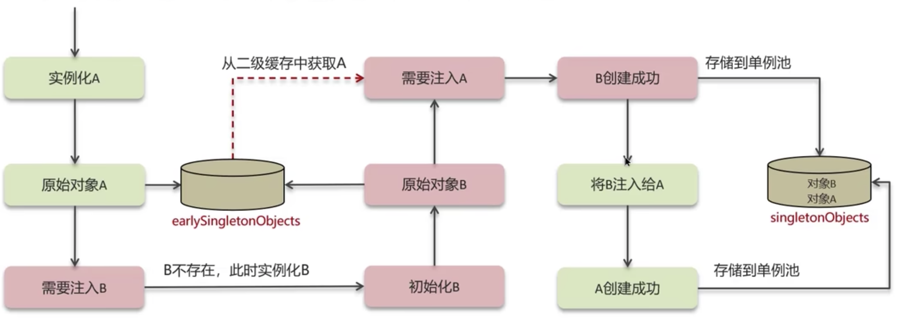
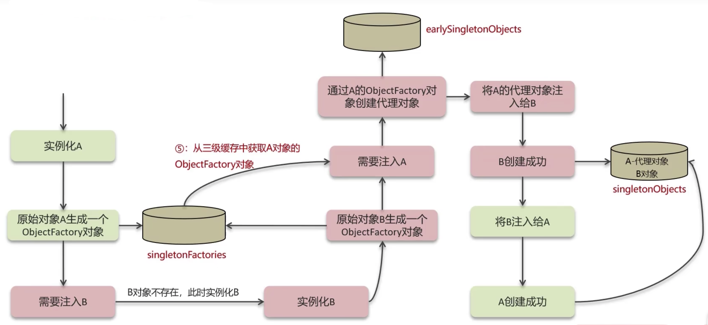

# Spring - SpringFramework

[[toc]]

## 1.IOC
IOC即Inversion of Control（控制反转），他是一种设计思想，对比于传统的创建对象方式，在业务中new一个对象来使用；IOC最大的特点就是spring是通过IOC容器来创建管理对象

IOC让程序员不再关注怎么去创建对象，而是关注创建对象之后的操作，把对象的创建、初始化、销毁等工作交给IOC容器来做。

BeanFactory是IOC容器的核心interface，常用的ApplicationContext就是他的一个具体实现，其中定义了一个核心的beanDefinitionMap
```java
private final Map<String, BeanDefinition> beanDefinitionMap;
```
beanDefinitionMap的Key为Bean的名字，Value为BeanDefinition，BeanDefinition中包含了很多Bean的元数据，例如：

- class，表示Bean类型
- scope，表示Bean作用域，单例或原型等
- lazyInit：表示Bean是否是懒加载
- initMethodName：表示Bean初始化时要执行的方法
- destroyMethodName：表示Bean销毁时要执行的方法 

而单例Bean的对象实际存在一个单例池——`singletonObjects`中：
```java
# DefaultSingletonBeanRegistry.class
private final Map<String, Object> singletonObjects = new ConcurrentHashMap(256);
```

所以说，在用户使用时：

- 在Bean初始化的时候，会将Bean的基本信息注册到beanDefinitionMap中，根据scope判断如果是单例Bean，还会new一个Bean的对象，放进单例池中（懒加载除外）。
- 在使用getBean()方法获取Bean的时候，根据scope判断是单例Bean还是原型Bean，如果是单例Bean就从这个单例池中取出，如果是原型Bean就new一个返回。

### 1.1 DI（依赖注入）
依赖注入是实现IOC思想的一种具体实现，即Bean对象中的成员变量，由Spring容器进行注入，有两种方式进行注入：
- 基于XML注入
- 基于注解注入

## 2.Bean的生命周期

Spring的Bean与new的对象有很多区别，例如没有依赖注入的值。说明Spring需要一系列的初始化，才能将一个类变为一个Bean，示例流程如下：

UserService.class的无参构造方法 -> 对象 -> 依赖注入（给属性赋值）-> 初始化前（@PostConstruct）-> 初始化（InitlalizingBean） -> 初始化后（AOP） -> Bean

### 2.1 推断构造方法
Spring在将类实例化的时候，需要确定使用哪个类的构造方法，并且用这个方法把这个类实例化成对象，主要规则如下：

1、如果一个类只有一个构造方法，Spring则会使用此构造方法
2、如果一个类没有构造方法，Spring则会使用默认的无参构造方法
3、如果一个类有多个构造方法，并且其中包含无参构造方法，Spring会使用这个无参构造方法
4、如果一个类有多个构造方法，且都是有参构造方法，Spring会报错

Spring的思路其实比较简单，如果一个类只有一个构造方法，那没得选，只能用这一个；如果多个构造方法，则去找其中的无参构造方法，因为无参构造方法本身就有一种默认的意义。如果在某个构造方法上加上@Autowire，则是为Spring指明了要用哪个构造方法实例化这个类。

### 2.2 依赖注入
得到一个对象后，Spring会判断该对象中是否有被@Autowire、@Resource、@Value等注解修饰的属性，这些属性由Spring进行赋值（依赖注入）

- @Value：将值注入到变量或方法当中，值可以直接指定，也可以从配置文件中获取
- @Autowire：作用于成员变量上，将值自动装配进来，默认是ByType策略，即根据变量类型从IOC容器中查找，可以配合@Qualifier注解指定Name，用ByName策略
- @Resource：作用于成员变量上，将值自动装配进来，默认是ByName策略，即根据变量的名称从IOC容器中查找，如果没有找到再使用ByType策略查找

### 2.3 Aware接口
依赖注入后，Spring会判断这个类是否实现了Aware回调接口（BeanNameAware、ApplicationContextAware、BeanFactoryAware等），如果有则调用当前类中实现的setBeanName()、setApplicaitonContext()、setBeanFactory()方法，并且把对应的值（BeanName、ApplicationContext、BeanFactory）作为入参传入方法中，用户可以在此方法中将其设置到局部变量里

### 2.4 初始化前BeanPostProcessor#Before
如果实现了BeanPostProcessor后置处理器接口中定义的postProcessBeforeInitialization()方法（可以实现多个），Spring会在所有Bean创建的时候回调所有实现的postProcessBeforeInitialization()方法。

### 2.5 初始化@PostConstruct
Spring会判断此类中是否有被@PostConstruct注解修饰的方法，如果存在，Spring会调用当前对象的此方法。

### 2.6 初始化InitializingBean
Spring会判断此类是否实现了InitializingBean接口，如果实现了则此类中一定实现了afterPropertiesSet()方法，Spring会调用当前对象中的此方法。

### 2.7 初始化后BeanPostProcessor#After
如果实现了BeanPostProcessor后置处理器接口中定义的postProcessAfterInitialization()方法（可以实现多个），Spring会在所有Bean创建的时候回调所有的实现的postProcessAfterInitialization()方法。

### 2.8 销毁Bean
Spring在ioc容器close的时候，会判断此类是否实现了DisposableBean接口，如果实现了此类中一定实现了destroy()方法，Spring会调用此方法；或者判断有没有@PreDestroy注释的方法，如果有也会调用

**验证代码**如下：

MyBean.java
```java
@Component
public class myBean implements BeanNameAware, InitializingBean, DisposableBean {

    public myBean (){
        System.out.println("开始推断构造方法，这是无参的构造方法");
    }

    public myBean (String test){
        System.out.println("开始推断构造方法，这是有参的构造方法");
    }

    @Value("wangzheng")
    public void setName(String name){
        System.out.println("开始进行依赖注入，注入了name为" + name);
    }

    @Override
    public void setBeanName(String s) {
        System.out.println("开始执行Aware方法，返回了BeanName为：" + s);
    }

    @PostConstruct
    public void testPostConstruct(){
        System.out.println("开始执行被PostConstruct注解的方法");
    }

    @Override
    public void afterPropertiesSet() throws Exception {
        System.out.println("开始执行InitializingBean接口的afterPropertiesSet方法");
    }

    @Override
    public void destroy() throws Exception {
        System.out.println("这里要执行销毁时的方法");
    }
}
```
customBeanPostProcessor.java
```java
@Component
public class customBeanPostProcessor implements BeanPostProcessor {

    @Override
    public Object postProcessBeforeInitialization(Object bean, String beanName) throws BeansException {
        if (beanName.equals("myBean")) {
            System.out.println("这里执行了BeanPostProcessor中Before方法" + beanName);
        }
        return bean;
    }

    @Override
    public Object postProcessAfterInitialization(Object bean, String beanName) throws BeansException {
        if (beanName.equals("myBean")) {
            System.out.println("这里执行了BeanPostProcessor中After方法" + beanName);
        }
        return bean;
    }
}
```
运行后查看日志：
```java
开始推断构造方法，这是无参的构造方法
开始进行依赖注入，注入了name为wangzheng
开始执行Aware方法，返回了BeanName为：myBean
这里执行了BeanPostProcessor中Before方法myBean
开始执行被PostConstruct注解的方法
开始执行InitializingBean接口的afterPropertiesSet方法
这里执行了BeanPostProcessor中After方法myBean
2023-07-03 16:25:22.319  INFO 23152 --- [           main] o.s.b.w.embedded.tomcat.TomcatWebServer  : Tomcat started on port(s): 9000 (http) with context path ''
2023-07-03 16:25:22.326  INFO 23152 --- [           main] com.example.wzdemo.WzdemoApplication     : Started WzdemoApplication in 1.61 seconds (JVM running for 2.402)
Disconnected from the target VM, address: '127.0.0.1:55647', transport: 'socket'
这里要执行销毁时的方法

Process finished with exit code 130
```

备注：代理对象的生命周期：
代理对象会在BeanPostProcessor中生成，并且替换掉普通对象的Bean，加入单例池中，例如UserService$Proxy替换UserService，而原普通对象则作为代理对象中的一个属性target，等待被调用。而代理类本身是没有依赖注入等相关内容的，由于普通对象已经进行完生命周期直到AOP前的操作，也就是说普通对象是有依赖注入的内容的，所以代理对象的业务逻辑实际上还是调用的普通对象的方法，用的是普通对象的依赖注入的属性。

## 3.AOP
AOP是面向切片编程，他允许开发人员将切面与业务逻辑分离，实现通用功能的解耦。
SpringAOP使用切点（Ponitcut）来定义在何处应用切面（Aspect），也就是说需要首先设置Pointcut的类或注解定义切点，再使用@Before(这个切点)等定义切面逻辑。

### 3.1 AOP的基本概念
首先需要说明的是，AOP的概念并非Spring特有的，比如通过注解的方式Spring是依赖于AspectJ的注解实现的（但是注解会执行的具体逻辑还是Spring自己做的），AspectJ与Spring AOP的主要区别是：AspectJ是在编译时Java字节码进行修改，在**编译**阶段就已经生成了代理类的字节码，而Spring的AOP是在运行时使用**动态代理**机制，生成代理对象的。
以下是AOP的一切基本概念
1. Aspect：表示切面，比如被@Aspect注解的类就是切面，可以在切面中去定义Pointcut、Advice等等
2. Join point：表示连接点，表示一个程序在执行过程中的一个点，比如一个方法的执行，比如一个异常的处理，在Spring AOP中，一个连接点通常表示一个方法的执行。
3. Advice：表示通知，表示在一个特定连接点上所采取的动作。在很多AOP框架中，包括Spring，会用Interceptor拦截器来实现Advice，并且在连接点周围维护一个Interceptor链，Spring的Advice主要包括@Before前置通知、@After后置通知、@Around环绕通知、@AfterReturning、@AfterThrowing
4. Pointcut：表示切点，用来匹配一个或多个连接点，Advice与切点表达式是关联在一起的，Advice将会执行在和切点表达式所匹配的连接点上
5. Introduction：可以使用@DeclareParents来给所匹配的类添加一个接口，并指定一个默认实现
6. Target object：目标对象，被代理对象
7. AOP proxy：表示代理工厂，用来创建代理对象的，在Spring Framework中，要么是JDK动态代理，要么是CGLIB代理
8. Weaving：表示织入，表示创建代理对象的动作，这个动作可以发生在编译时期（比如Aspejctj），或者运行时，比如Spring AOP

### 3.2 Sping AOP的使用
以通过注解作为切点为例，定义一个注解`@Print`
```java
@Target(ElementType.METHOD)
@Retention(RetentionPolicy.RUNTIME)
public @interface Print {
}
```

其次，定义一个Interceptor类，此类加上@Aspect注解，在这个类里定义切点为Print注解，切面去使用这个切点

```java
@Aspect
@Component
public class Interceptor {

    @Pointcut("@annotation(com.example.wzdemo.aop.annotation.Print)")
    public void needPrintMethod(){}

    @Before("needPrintMethod()")
    public void beforePrint(JoinPoint joinPoint){
        System.out.println("开始执行Before切面逻辑");
    }
}
```

加一个测试的业务接口，使用自定义注解Print修饰业务方法

```java
@RestController
@RequestMapping("/aop")
public class Controller1 {

    @GetMapping("/print")
    @Print()
    public void testPrint(){
        System.out.println("这里到主流程");
    }
}
```
调用这个接口，日志打印
```
开始执行Before切面逻辑
这里到主流程
```
### 3.3 AOP的原理
AOP主要有两个实现，基于cglib和基于jdk的实现，首先通过手写的方式展示一下这两者的运作逻辑

#### 3.3.1 基于cglib的动态代理实现
创建一个业务类：UserService
```java
public class UserService {
    public void test(){
        System.out.println("这是userService的主逻辑");
    }
}
```
之后定义一个cglib的拦截器，重写其中的拦截方法intercept

```java
public class MyInterceptor implements MethodInterceptor {
    @Override
    public Object intercept(Object o, Method method, Object[] objects, MethodProxy methodProxy) throws Throwable {
        System.out.println("这里是拦截方法执行之前");
        Object result = methodProxy.invokeSuper(o, objects);
        System.out.println("这里是拦截方法执行之后");
        return result;
    }
}
```
最后实现一个可运行的测试类，其中使用Enhance来创建UserService的代理对象，用代理对象执行原对象的test方法
```java
public class UserServiceProxy {
    public static void main(String[] args) {
        Enhancer enhancer = new Enhancer();
        // 设置被代理类
        enhancer.setSuperclass(UserService.class);
        // 设置拦截器
        enhancer.setCallback(new MyInterceptor());
        // 创建代理对象
        UserService userServiceProxy = (UserService) enhancer.create();
        //执行实际逻辑
        userServiceProxy.test();
    }
}
```

控制台打印：

```
这里是拦截方法执行之前
这是userService的主逻辑
这里是拦截方法执行之后
```

#### 3.3.2 基于jdk的动态代理实现
@TBD


#### 3.3.3 JDK动态代理和CGLIB动态代理区别
JDK动态代理只能用于接口的实现类，CGLIB没有这个限制

JDK动态代理利用Java的反射机制，可以在运行时通过代理类来生成代理对象。代理对象实现了目标接口，并在方法调用时将控制权转交给实际的被代理对象。

CGLIB通过继承目标类并生成其子类来实现代理，绕过了Java语言对接口的限制，但这也导致了在生成代理对象时需要进行字节码操作，相比JDK动态代理的反射机制，性能稍微有所下降。

#### 3.3.4 ProxyFactory
上面介绍了两种动态代理的实现，这两者在Spring中都进行了封装，成为一个工厂ProxyFactory，是创建代理对象的一个工厂，通过ProxyFactory，使用者可以不用关心用cglib还是jdk动态代理了，如果UserService实现了接口就会用jdk，如果没有实现接口就是cglib。

总的来说，不论是通过new一个ProxyFactory对象的编程方式来创建代理对象，还是通过@Pointcut和@After注解来进行AOP，Spring底层使用ProxyFactory来生成代理对象。


## 4.Transactional
### 4.1 Spring中事务的基本概念
首先，需要在启动类上加上@EnableTransactionManagement注解，表示需要开启Spring事务管理。核心是配置一个TransactionlInterceptor拦截器，通过AOP进行事务配置

举例：例如在userService.test()方法上加上了@Transactionl注解：

1、会先进入TransactionlInterceptor.invoke()方法（invoke方法可以理解为环绕通知）
2、再调用原方法userService.test()
3、继续TransactionlInterceptor.invoke()方法

invoke()方法具体做了这些事：

1、利用配置的PlatformTransactionManager事务管理器新建一个数据库连接（PlatformTransactionManager SpringBoot会自动装配）
2、修改此连接的autocommit=false
3、数据库连接conn放进ThreadLocal<DataSource,conn>中
4、执行proceed()方法，其实就是执行原业务
5、如果执行成功则commit、如果报错则rollback

### 4.2 事务的传播机制
首先说明事物的传播是如何实现的，例如A方法加了@Transactionl注解，A方法中调用B方法，希望A方法与B方法是两个独立的事务，B方法需要加@Transactional(propagation = Propagation.REQUIRES_NEW)注解，Spring是如何实现的呢？主要是通过暂存数据库连接实现的。还是以上述invoke()方法做的事为例：

1、A方法利用配置的PlatformTransactionManager事务管理器新建一个数据库连接
2、修改此连接的autocommit=false
3、数据库连接conn放进ThreadLocal<DataSource,conn>中
4、执行proceed()方法，其实就是执行原业务，调用B方法
(
4.1、执行B方法之前先判断ThreadLocal中DataSource是否为空，如果不为空则证明已经有数据库连接了，则需要暂存数据库连接，new一个对象来保存当前ThreadLocal中的conn
4.2、B方法利用配置的PlatformTransactionManager事务管理器新建一个数据库连接
4.3、修改此连接的autocommit=false
4.4、数据库连接conn放进ThreadLocal<DataSource,conn>中，此时会覆盖掉A方法的数据库连接
4.5、执行B方法的原业务
4.6、如果执行成功则commit、如果报错则rollback
4.7、B方法的数据库连接提交之后，将暂存的conn重新设置回ThreadLocal中，恢复A方法的连接
)
5、继续执行A方法其他逻辑
6、如果执行成功则commit、如果报错则rollback

这个过程中最为核心的是：在执行某个方法时，判断当前是否已经存在一个事务，就是判断当前线程的ThreadLocal中是否存在一个数据库连接对象，如果存在则表示已经存在一个事务了。暂存当前事务再恢复的这个过程就叫**挂起**

@Transactionl注解中propagation属性的值有以下几种
- required（默认）：如果当前没有事务，就创建一个事务；如果当前存在事务，就加入此事务
- requirs_new：创建新的事务，如果当前存在事务，就将它暂时挂起
- supports：支持当前事务，如果当前存在事务，就加入此事务；如果当前没有事务，就以非事务的方式运行（support不会创建新事务）
- not_supported：不支持当前事务，如果当前存在事务，就将其挂起；如果当前没有事务，就以非事务的方式运行（support不会创建新事务）
- nested：如果当前存在事务，则嵌套在当前事务中执行，与加入不同的是，内部回滚不影响外部，但外部会影响内部；如果当前不存在事务，就创建一个事务
- mandatory：强制必须使用事务，使用当前的事务，如果当前事务不存在直接抛出异常
- never：禁止事务，以非事务的方式运行，如果当前存在事务直接抛异常

### 4.3 事务的隔离级别

- ISOLATION_DEFAULT：默认级别，用mysql的事务隔离级别
- ISOLATION_READ_UNCOMMITTED：读未提交
- ISOLATION_READ_COMMITED：读已提交
- ISOLATION_REPEATABLE_READ：可重复读
- ISOLATION_SERIALIZABLE：可串行

### 4.4 事务失效的场景
1、异常被捕获，自己处理了异常；解决方案：处理后再手动抛出异常
2、抛出检查异常，Transacional默认只回滚非检查异常；解决方案：配置@Transactional注解的属性rollbackFor为Exception
3、非public方法加上注解；解决方案：改为public

## 5.Bean的循环依赖问题

循环依赖即BeanA自动注入了BeanB，同时BeanB也自动注入了BeanA，根据Bean的生命周期以及自动注入的原理，不难看出此时会发生死循环的问题，因为BeanA依赖注入发生的时候对象刚通过构造方法构造，还不是一个完整的Bean。

例如BeanA实例化后，就需要注入BeanB了，此时BeanB也没有成为一个Bean，就会去创建BeanB的Bean，BeanB创建又会去找BeanA，但BeanA也不是一个Bean，又会回去找Bean，这样就陷入了一个死循环。

但是Spring通过三级缓存，已经帮助解决了绝大多数循环依赖的情况：
一级缓存：singletonObjects单例池，缓存走完Bean初始化流程的对象
二级缓存：earlySingletonObjects半成品单例池，缓存刚实例化后、还未进行依赖注入的Bean对象
三级缓存：singletonFactories单例工厂池，缓存Object的工厂，可以创建代理对象

### 5.1 二级缓存解决普通对象生成




如图所示，在BeanA实例化后、未进行依赖注入前，就先将自己实例化后的这个对象，作为半成品，加入二级缓存-earlySingletonObjects半成品单例池中。

接下来进行依赖注入，BeanA需要注入BeanB，BeanB还不存在，则createBean，实例化后也将半成品BeanB放入二级缓存中，之后依赖注入BeanA的时候，先从二级缓存中获取A的半成品，进行依赖注入，让B可以继续初始化下去，直到成功，再将初始化好的B注入给A。由于都是单例Bean，在B中的半成品A也自然而然的变成了成品的BeanA

但是这种方式有一种无法解决的问题，则是代理对象的创建，就算将原始对象存在二级缓存中，如果注入的是一个被增强的类的话，还是无法解决问题。

### 5.2 三级缓存解决代理对象生成



通过三级缓存Obejct工厂对象，就可以通过Object工厂生成代理对象了，如图所示就是A被增强的情况，通过三级缓存中A的对象工厂生成代理对象Bean进行注入

### 5.3 三级缓存无法解决的循环依赖
但是通过三级缓存并不是全部可以解决的，如果是构造器的循环注入则无法解决，需要手动加一个@Lazy注解

PS：需要注意的是，在Spring2.6之后，默认不再提供解决循环依赖的问题，因为Spring不推荐此方式，如果实在需要，需要在配置文件中手动开启

## 6.Spring中的设计模式

1、工厂模式
Spring通过BeanFactory工厂模式创建、获取Bean
2、单例模式
Spring中Bean的默认作用域就是singleton单例的
3、代理模式
SpringAOP就是基于代理模式，生成代理类实现的
4、观察者模式
Spring事件驱动模型就是基于观察者模式实现的，ApplicationEvent
5、适配器模式
Spring中AOP的AdvisorAdapter适配器就是适配器模式的提现
6、装饰器模式
Spring中含有Decorator的类
7、策略模式
Spring通过Resource接口访底层资源