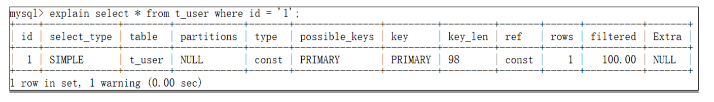

# MySQL - 基础

[[toc]]

## 1.SQL执行计划
通过EXPLAIN或者DESC分析SQL的执行计划：



其中主要查看以下字段
- key：当前SQL实际命中的索引
- key_len：索引的长度
- type：为这条SQL连接的类型，从性能高到低分别为：
  - NULL
  - system：查询系统表
  - const：根据主键查询
  - eq_ref：主键索引查询或唯一索引查询
  - ref：非唯一索引查询
  - range：索引内范围查询
  - index：扫描全索引
  - all：全盘搜索
- extra：额外提示，可以看是否覆盖索引


## 2.JOIN连表查询相关


A表：
aID　　　　　aNum
1　　　　　a20050111
2　　　　　a20050112
3　　　　　a20050113
4　　　　　a20050114
5　　　　　a20050115
B表：
bID　　　　　bName
1　　　　　2006032401
2　　　　　2006032402
3　　　　　2006032403
4　　　　　2006032404
8　　　　　2006032408

### 2.1 LEFT JOIN

```sql
select * from A
left join B 
on A.aID = B.bID
```

Result：
aID　　　　　aNum　　　　　bID　　　　　bName
1　　　　　a20050111　　　　1　　　　　2006032401
2　　　　　a20050112　　　　2　　　　　2006032402
3　　　　　a20050113　　　　3　　　　　2006032403
4　　　　　a20050114　　　　4　　　　　2006032404
5　　　　　a20050115　　　　NULL　　　　　NULL

### 2.2 RIGHT JOIN

```sql
select * from A
right join B 
on A.aID = B.bID
```

Result：
aID　　　　　aNum　　　　　bID　　　　　bName
1　　　　　a20050111　　　　1　　　　　2006032401
2　　　　　a20050112　　　　2　　　　　2006032402
3　　　　　a20050113　　　　3　　　　　2006032403
4　　　　　a20050114　　　　4　　　　　2006032404
NULL　　　　　NULL　　　　　8　　　　　2006032408

### 2.3 INNER JOIN

```sql
select * from A
inner join B 
on A.aID = B.bID
```

Result：
aID　　　　　aNum　　　　　bID　　　　　bName
1　　　　　a20050111　　　　1　　　　　2006032401
2　　　　　a20050112　　　　2　　　　　2006032402
3　　　　　a20050113　　　　3　　　　　2006032403
4　　　　　a20050114　　　　4　　　　　2006032404

在连表查询的时候，有一个最重要的原则就是小表驱动大表，原因主要是减少表连接的创建次数，降低查询时间。

## 3.MySQL主从同步原理


## 4.MySQL分库分表

### 4.1 垂直分库分表


垂直分表可以理解为在表上垂直切一刀，将某些列单独拆分出到其他表上，可能是把不常用的字段单独拆出来，或把Text、Blob等大字段单独拆出来，用主键进行关联

垂直分库就是将一个库中的不同表按业务拆分到不同的库中，主要参考微服务架构

### 4.2 水平分库分表


水平分库分表即在表上水平切，把不同行存到相同结构的不同表或不同库中，降低单表单库的压力，一般在表数据达到千万级别就可以考虑水平分库分表了，这种数量级加索引的优化效果已经不大。

此时需要路由规则路由到具体表上，路由规则有：
（1）根据id%3取余，也就是库1存0、3、6；库2存1、4、7；库3存2、5、8。
（2）按id范围路由，节点1（1-100万），节点2（100万-200万）

取余以后需要加表的时候较麻烦，需要把行重新定位；按id范围路由可能会导致冷表热表的问题


### 4.3 分库分表后引起的问题
分库分表后可能会引起一起单表不会发生的问题，比如：
1、分布式事务一致性问题
2、跨库的关联查询
3、跨库的分页、排序查询

可以通过一些数据库中间件解决，或自己定义中间层，分库分表的中间件：
sharding-sphere
mycat
