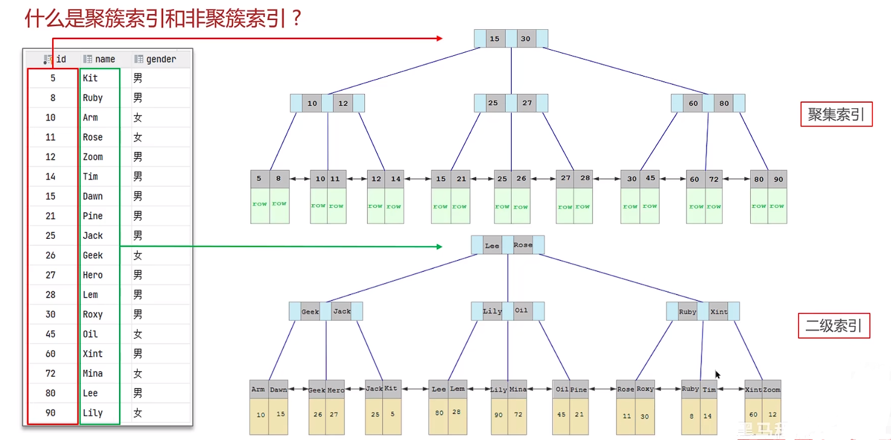
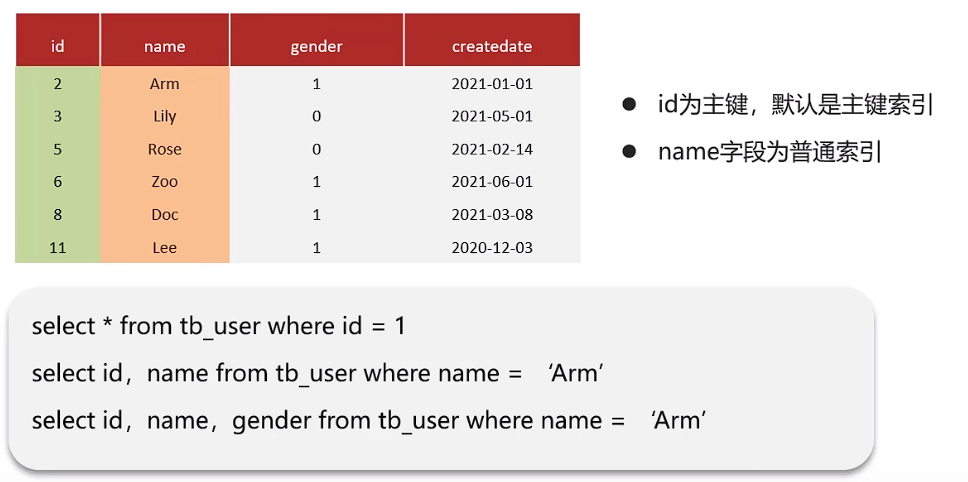

# MySQL - 索引

[[toc]]

## 1.索引基本概念

索引Index是帮助MySQL高效获取数据的的数据结构，用来提升数据检索的效率，主要有以下两点优势：
1、提高数据检索效率，降低数据库IO（不需要做全表扫描）
2、通过索引列对数据进行排序，降低排序成本

Mysql的InnoDB引擎默认采用B+树的数据结构存储索引，详情参考数据结构一节，主要有以下的好处：
- 磁盘读写代价B+树更低，非叶子节点只存储key，叶子节点存储数据
- 由于B+树叶子节点是一个双向链表，比B树更适合扫全库和区间查询
- 由于B+树的数据只存在叶子节点上，每次查询的路径都为树的层数，所以在查询的时候，查询的时间更稳定

索引的种类包括：
- 主键索引
- 唯一索引（索引中的值每行唯一）
- 复合索引（实际项目中常用）

## 2.聚集索引与二级索引
聚簇索引与非聚簇索引也叫聚集索引与二级索引，主要特点如下：

（1）聚集索引（Clustered Index）
将数据与索引存储到一起，即索引结构B+树中的叶子节点保存了整行的数据，必须存在并且唯一

（2）二级索引（Secondary Index）
将数据与索引分开存储，即索引结构B+树中的叶子节点保存的是对应主键，可以存在多个

索引选取规则如下：
1、如果存在主键，主键索引就是聚集索引
2、如果不存在主键，第一个唯一索引就是聚集索引

如图所示表中有三列，id列、name列分别有索引，其中id列的索引为聚集索引，在叶子节点上即以id为Key，整行的数据为Value存储。name列的索引则是二级索引，在叶子节点上以name为Key，主键为Value。

## 3.回表查询
通过二级索引查询到主键值，再拿着主键值到聚集索引中查找整行数据，这个过程就是回表查询。

还是用上述的表为例，如果要执行SQL：`SELECT * FROM user WHERE name = 'arm'`，由于查询条件是name列，会走name列的二级索引，经过比对找到叶子节点上Key为Arm对应的数据，也就是主键id为10，但是此SQL需要查询的是*，所以还需要拿着主键id=10，再回到聚集索引中，经过对比找到id为10的整行数据row，再进行返回

## 4.覆盖索引
覆盖索引是指查询时条件用到了索引，查询的返回列必须在索引中直接查到，这样才叫覆盖索引，也就是说只需要在一颗索引树上就能获取SQL所需要的全部列，需要回表查询的都不是覆盖索引，性能相对较差

如图所示：
- 第一条SQL为覆盖索引，是因为id列为聚集索引，包含了整行的数据，SELECT *获取整行也不需要回表查询
- 第二条SQL为覆盖索引，name列为二级索引，包含了name本身的值以及对应的主键值，正好SELECT id，name列，只通过二级索引这一颗索引树即可获取返回值，不需要回表
- 第三条SQL不是覆盖索引，包含了非索引列gender，无法通过一颗索引树直接获取，需要进行回表查询（如果把name和gender设置为联合索引，此SQL仍为覆盖索引）

PS：如果为覆盖索引，EXPLAN SQL的时候extra列会提示：using index

## 5.创建索引的原则
1、针对数据量较大，且查询操作比较频繁的表建立索引
2、索引数量不宜过多，索引越多，增删改的效率越低，因为在增删改原表的同时还需要维护索引结构
3、针对常作为查询条件（WHERE）、排序（ORDER BY）、分组（GROUP BY）操作的列字段建立索引
4、根据业务优先使用联合索引，联合索引很多时候可以覆盖索引

## 6.什么情况下索引会失效
（1）违反最左前缀原则
例如创建一个3列的联合索引(col1,col2,col3)，则已经对(col1)、(col1,col2)、(col1,col2,col3)上建立了索引，如果查询条件包含了col1、col2，哪怕条件的顺序并非是col1、col2，也可以走(col1,col2)的联合索引，但是如果查询条件为col2、col3，索引会失效，因为没有遵循最左前缀原则

（2）模糊查询以%开头
例如查询条件中LIKE ‘%WZ’会失效，LIKE 'WZ%'则可以使用索引，主要原因是字符串匹配是从前到后的顺序

（3）范围查询右侧的列
例如WHERE a = 1 AND b = 2 AND c > 3 AND d =4，其中abcd列有联合索引，但是由于c列走了范围索引，所以实际触发了abc列的索引，并没有触发d列

（4）在索引列上进行运算操作
例如WHERE substring(name,3,2)，name列已有索引，但查询条件中对其进行了运算操作，索引失效