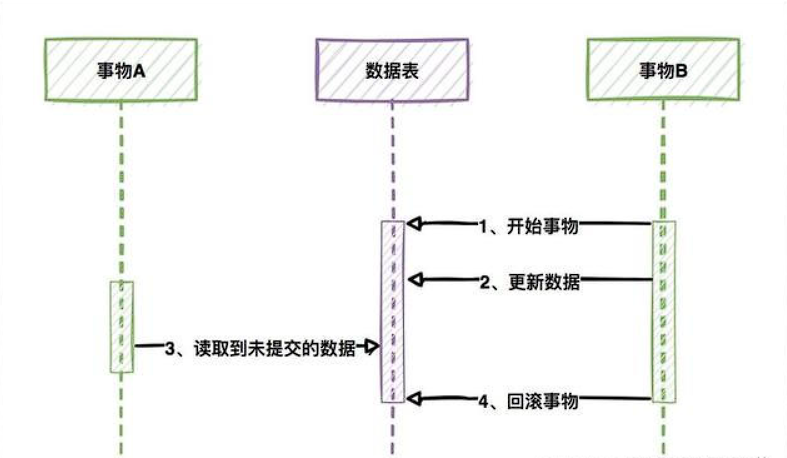
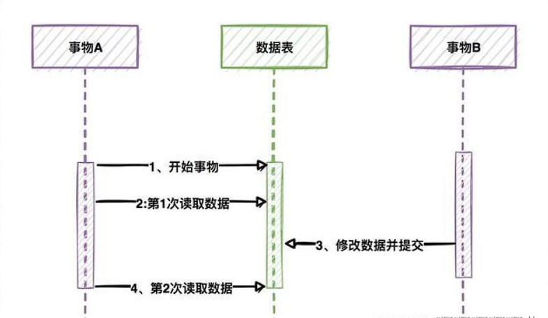
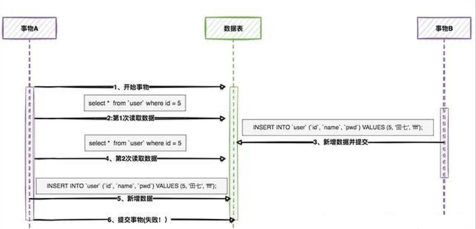
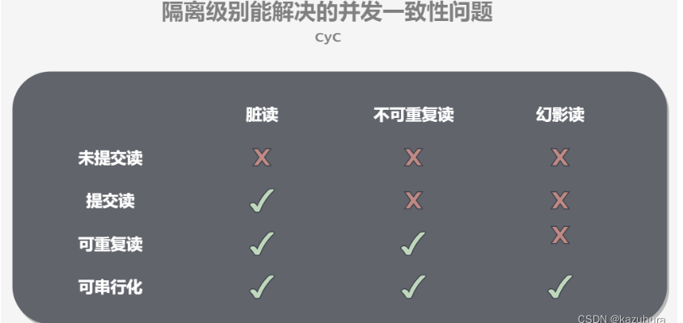
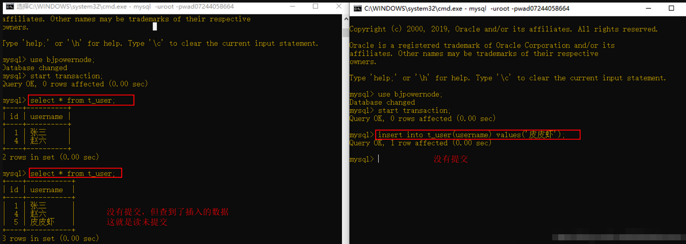
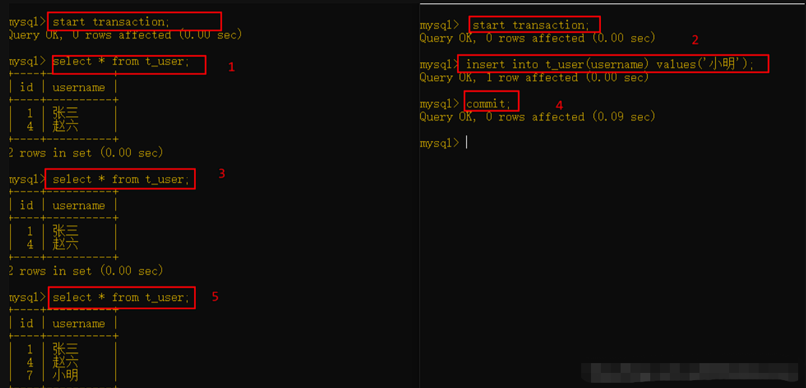
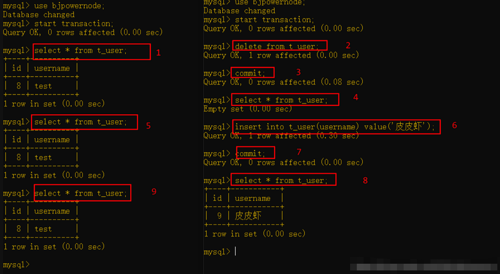
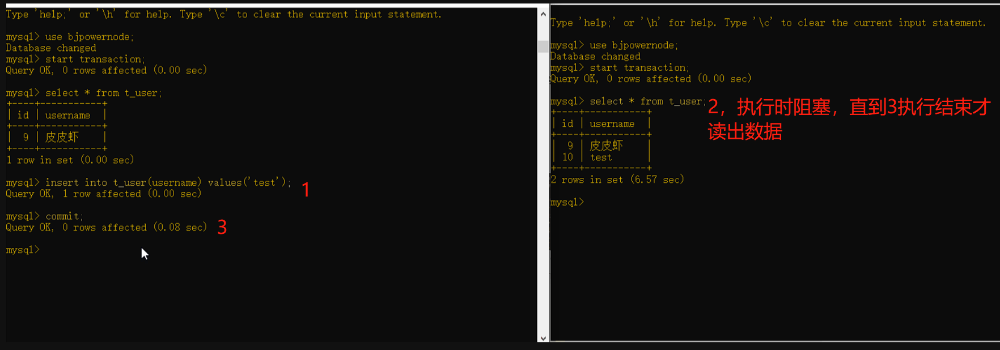
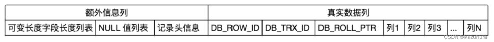
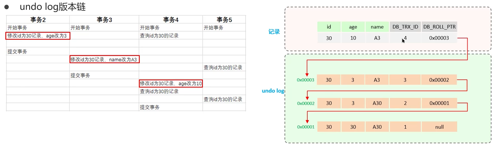

# MySQL - 事务

[[toc]]

## 1.事务基本概念
事务是一组操作的整合，他是不可分割的工作单位，事务会把这一组操作作为一个整体，一起向系统提交，这些操作要么全部成功，要么全部失败。
事务的ACID原则：
- A/Atomicity（原子性）：一个事务中的一组SQL为一个不可分割的整体，要么全部成功、要么全部失败
- C/Consistency（一致性）：事务执行的结果必须是使数据库从一个一致性状态变到另一个一致性状态。例如执行前库存为10000，订单消耗库存为0，两者加起来为10000；执行事务后，库存还剩9000，订单消耗库存1000，两者加起来仍为10000
- I/Isolation（隔离性）：两个事务并发操作，互相不受影响
- D/Durability（持久性）：事务执行完毕或回滚后，对数据库的数据修改是写入磁盘做持久化处理

## 2.事务可能引起的问题

### 2.1 脏读
一个事务读到另外一个事务还未提交的数据

### 2.2 不可重复读
一个事务先后读取同一条数据，两次获取的数据内容不同

### 2.3 幻读
一个事务查询某个数据时显示该行不存在，将其插入时又发现这行已存在，仿佛出现了幻影

不可重复读侧重表达 读-读，幻读则是说 读-写。这些问题可以通过事务的隔离级别来解决

## 3.事务的隔离级别

### 3.1 读未提交 READ UNCOMMITTED

性能最好，可以理解为压根就没加锁，没有隔离

可以看到左侧事务可以直接读到右侧未提交的行

### 3.2 读已提交 READ COMMITTED

解决脏读

可以看到左侧事务在右侧事务未提交插入行的时候，无法查出添加的行，直到右侧事务提交修改，才可以查到

### 3.3 可重复读 REPEATABLE READ （MYSQL默认）

解决脏读、不可重复读

可以看到右侧事务不断的删除和插入数据，但左侧事务读出的还是原来的数据，说明读取的是备份数据

### 3.4 可串行 SERIALIZABLE 

解决脏读、不可重复读、幻读

串行就是处理一个人请求的时候，别的人都等着。读的时候加共享锁，也就是其他事务可以并发读，但是不能写。写的时候加排它锁，其他事务不能并发写也不能并发读。

左侧事务插入一行后但未提交，右侧事务读取数据的请求被阻塞住，无返回值，直到左侧事务提交后，右侧事务才获取到正确值

## 4.undo log和redo log
`redo log`记录了数据页的物理变化，服务器宕机的时候可以做数据恢复

`undo log`记录了逻辑操作的逆操作，可以用作回滚操作

`redo log`保证了事务的持久性、`undo log`保证了事务的原子性和一致性

PS：`redo log`与`binlog`的区别：
1、`redo log`用于崩溃恢复；`binlog`用于主从复制、数据备份
2、`redo log`记录的是物理日志；`binlog`记录的是逻辑日志

## 5.mvcc机制

mvcc全称Multi-Version Concurrency Control，多版本并发控制，是指维护一个数据的多个版本，使得读写操作没有冲突。

多版本并发控制是InnoDB实现`读已提交`、`可重复读`两种事务隔离级别的方式，其他事务隔离级别例如`读未提交`，无需MVCC控制；`可串行化`需要加锁，光凭MVCC无法实现

InnoDB引擎在实际存储行数据时，会额外加三列隐藏数据:

- DB_ROW_ID：行id，在没设置主键的时候作为隐藏主键使用
- DB_TRX_ID：事务id，标明了当前行是被哪个事务修改的
- DB_ROLL_PTR：回滚指针，指向undo log中上一个版本

如图所示，不同事务或者相同事务对同一行数据进行修改，会在undo log中记录一个版本链表，主数据中隐藏属性DB_ROLL_PTR指向undo log中的一条回滚数据，并且以一条单向链表的形式不断记录回滚记录。

ReadView是解决事务查询选择哪个版本的问题，根据其的匹配规则去判断访问哪个版本的数据。不同的隔离级别使用的ReadView规则也不太一样：
1、RC读已提交：每一次执行读的时候生成ReadView
2、RR可重复读：仅在事务第一次执行读的时候生成ReadView，后续复用