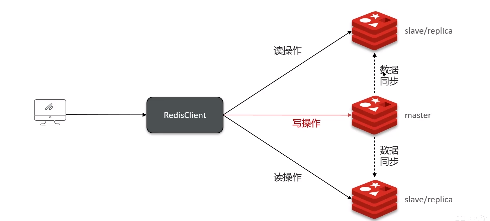
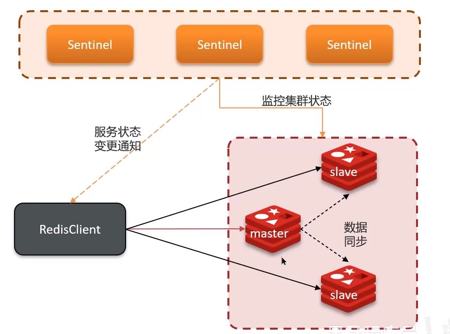
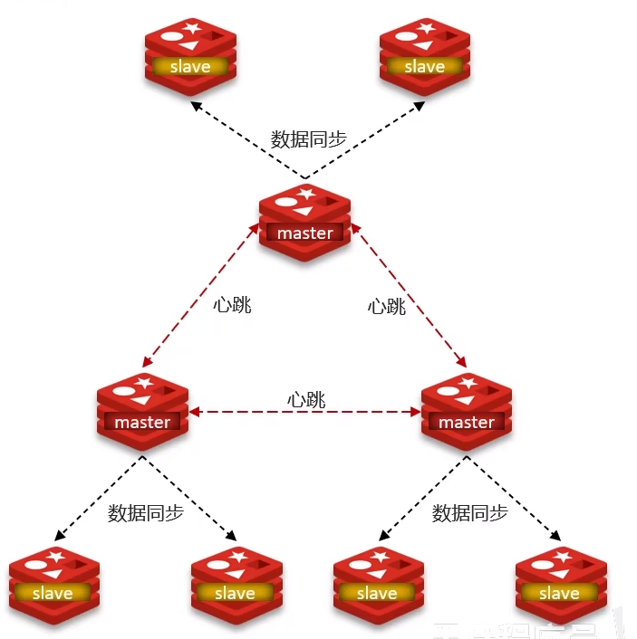

# Redis - 基础

[[toc]]

## 1.Redis集群方案

### 1.1 主从模式

主从复制集群，实现读写分离，提升性能。一般来说都是一主多从，master可以执行读写操作，slave只能执行读操作

主从数据同步，主节点的数据发生变化，会同步至从节点，有两种形式：

主从*全量同步*：
主节点执行bgsave，生成RDB文件，发送给从节点执行

主从*增量同步*：
通过offset偏移量获取主从的差值，发送差值文件给从节点执行

### 1.2 哨兵模式
解决主从模式的一个弊端，当master挂了后，无法提供写操作，哨兵Sentinal会监听到master挂掉，从slave中自动选举一个新master，若原master恢复后，则会成为新的slave

### 1.3 集群模式
cluster模式是Redis的分布式解决方案，解决了主从模式和哨兵模式无法解决的高并发写的问题。最大的特点是可以有多个master，并且自动将数据进行分片存储，客户端可以访问集群任意节点，最终都会转发至正确节点

## 2.Redis为什么快
（1）Redis是一种基于内存的数据库，所有数据存储在内存中，读取和写入速度快
（2）Redis支持的数据结构相对比较简单、字符串、哈希表、列表，针对这些数据结构都已经经过了优化，
（3）Redis默认是单线程的，更适合IO密集型的场景，没有锁增加开销

## 3.Redis支持的数据类型