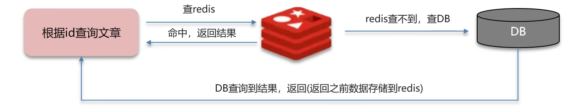
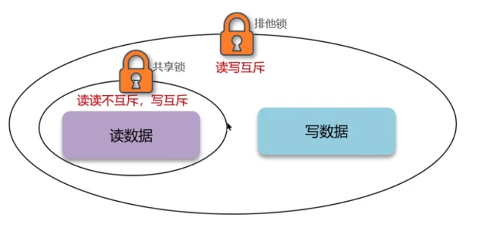

# Redis - 缓存

[[toc]]

## 1.缓存常见的问题

以下三个问题均基于以Redis作为缓存的基础

### 1.1 缓存穿透

缓存穿透即短时间内大量请求一定不存在的Key，在Redis中没有对应的缓存，数据库中也查不到，并且不会写到缓存中，导致每次请求都会到数据库，给数据库较大压力



**解决方案一**：缓存空数据
mysql查询为空，仍然把这个空进行缓存{key:1,value:null}
优点：实现简单
缺点：请求随机数无法解决问题，消耗redis内存

**解决方案二**：布隆过滤器


在服务跟Redis中间加一层布隆过滤器，如果布隆过滤器中存在，才放行请求到Redis，如果不存在直接返回。布隆过滤器通过hash函数+bitmap位图实现，可能会产生哈希冲突，所以存在误判的可能
优点：内存占用少，没有多余的key
缺点：存在误判的可能

### 1.2 缓存击穿

缓存击穿有两种可能：
1、Redis中一个冷门Key，缓存中未存储，突然被大量请求访问
2、Redis中一个热门Key，缓存中存储但恰好过期，突然被大量请求访问
这样也会瞬时给数据库较大压力


**解决方案一**：加锁
在查询缓存未命中的时候加锁，再去查询数据库，重建缓存数据，写入缓存后再释放锁
优点：保证数据强一致性
缺点：性能较差

**解决方案二**：永不过期
对于热点Key设置永不过期，如果数据库中有修改再同步修改缓存中数据
优点：性能强，高可用
缺点：无法保证数据库与缓存强一致

### 1.3 缓存雪崩
缓存雪崩是指在同一时间，大量的缓存Key同时失效或者Redis服务宕机，导致大量请求到数据库，带来巨大压力，与缓存击穿最大的区别是雪崩是针对多个Key的，击穿是针对某一个Key。


**解决方案一**：不同Key的过期时间增加随机值，避免大量Key在同一时间失效

**解决方案二**：Redis宕机可以用集群模式提升可用性

### 1.4 总结
这三者的本质区别是：

缓存穿透：大量Key在缓存中不存在，数据库中也不存在
缓存击穿：单个Key在缓存中不存在（过期），数据库中存在
缓存雪崩：大量Key在缓存中不存在（过期），数据库中存在

这三个问题本质上都可以通过在服务层限流来解决


## 2.缓存的双写一致性
双写一致性：当修改了数据库的数据同时也要更新缓存的数据，也就是说缓存中的数据与数据库中的数据需要保持一致。

无论先更新数据库中的数据，再删除缓存的数据；还是先删除缓存的数据，再更新数据库的数据，均无法彻底保证强一致性，在高并发的场景下均有概率产生脏数据。

但是根据业务不同，对于一致性的要求也不同，例如支付等业务就需要保证强一致性，钱不能出问题，但大部分业务短暂的不一致是可以接受的，只要保证最终一致性即可

### 2.1 强一致性
想要保证双写强一致性就需要加锁，以分布式锁为例，在读写之前均加锁，保证强一致性。


但是这种方式的性能相对较差，可以参考使用redisson的读写锁，读锁用共享锁，加锁后其他线程可以共享读，但不能写；写锁用排他锁，加锁后阻塞其他线程的读写



### 2.2 最终一致性
保证最终一致性相对比较简单，可以通过一些中间件进行通知，例如MQ，这种方案肯定缓存会有一些延迟，但是只要保证MQ的可用性，即可保证缓存的最终一致性


## 3.缓存的持久化
Redis的持久化有两种方式，分别是RDB和AOF

### 3.1 RDB（Redis Database Backup file）
RDB全称Redis数据备份文件，也就是Redis的数据快照。简单来说就是把内存中的所有数据记录到磁盘里，当Redis重启时从磁盘读快照文件，恢复数据。

使用redis-cli执行save即可手动生成RDB文件、bgsave手动后台生成RDB，不影响主进程接收其他指令；或者修改Redis配置文件redis.conf配置

### 3.2 AOF（Append Only File）
appendonlyfile即追加文件，Redis处理的每一条命令都会记录在AOF中。


由于是记录所有命令，所以AOF文件会比RDB文件大的多，并且AOF会记录对一个Key操作的所以记录，但是其实只有最后一条才有意义，比如set num 123、set num 234，通过bgrewriteaof指令，可以只留下最后一条指令

### 3.3 总结
两者的优缺点总结如下：


这两种方式各有优缺点，在Redis4.0后提供了两者结合使用的功能`aof-use-rdb-preamble`，AOF仅记录RDB之后的操作记录，融合两者优点

## 4.数据过期策略
例如执行命令set name wz 10后，过10s后key为name，value为wz的这行应该会被清除，Redis有两种过期策略。
### 4.1 懒惰删除
设置该Key过期时间后，哪怕到时间了也不会在内存中删除，只有当需要该Key的时候才去检查是否过期，如果过期就删掉，如果没过期就返回
```shell
set name zhangsan 10
get name //此处发现name过期，再删除key
```
优点：CPU压力小，不需要全盘扫描判断，直到用的时候才判断
缺点：内存压力大，如果一个Key已经过期但没人用，那么该Key会一直存在内存中，内存永远不会释放

### 4.2 定期删除
每隔一段时间，对某些Key进行检查，删除其中过期的Key，频率可以通过改配置文件确定
优点：释放过期Key占用的内存
缺点：如果执行的太频繁，CPU压力大

### 4.3 总结
Redis实际上的过期策略，是懒惰删除+定期删除两种策略配合使用的

## 5.数据淘汰策略

当Redis的内存不够用的时候，此时再往Redis中添加新Key，那么Redis将会按照一些规则将内存中的数据删掉，这就是数据的淘汰策略，Redis中总共提供了8种淘汰策略：

- noeviction：不淘汰任何key，内存满的时候也不允许写入（默认！）
- volatile-ttl：对设置了TTL的key，比较key的剩余TTL值，淘汰最小的
- allkeys-random：对全体key，随机进行淘汰
- volatile-random：对设置了TTL的key，随机进行淘汰
- allkeys-lru：对全体key，基于LRU算法进行淘汰
- volatile-lru：对设置了TTL的key，基于LRU算法进行淘汰
- allkeys-lfu：对全体key，基于LFU算法进行淘汰
- volatile-lfu：对设置了TTL的key，基于LFU算法进行淘汰

备注：
LRU（Least Recently Used）最近最少使用。key的最后一次访问时间越远越先被淘汰
LFU（Least Frequently Used）最少频率使用。key的使用频率越低越先被淘汰

引申问题：数据库有1000w数据，但Redis中只能存20w条，如何保证Redis中的数据都是热点数据？
答：使用allkeys-lru淘汰策略，淘汰最近最少使用的数据，留下的都是经常访问的热点数据
